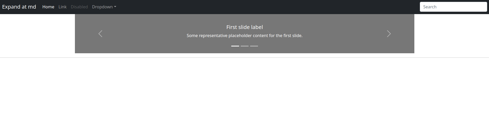

# Django 4 ile Uygulama Geliştirme 2

### 8. Django URL ve Klasör Yapısı

- https://docs.djangoproject.com/en/4.0/topics/templates/
- https://docs.djangoproject.com/en/4.0/ref/templates/language/
- https://docs.djangoproject.com/en/4.0/ref/templates/builtins/

Django doğrudan jinja2 kullanmaz ona çok benzeyen kendi template sistemini kullanır ancak jinja2'yi de kullanmak mümkündür üstteki linkte detaylar görülebilir.

Ayrıca istenirse bizzat Python'ın kendisi de template içinde kullanılabilir. Bunun için en çok kullanılan modüllerden birinin linkini aşağıda bulabilirsiniz. Reddit bu template dilini kullanılarak oluşturulmuş bir web sitesi.

- https://docs.makotemplates.org/en/latest/

Öncelikle sayfamızda kullanacağımız template ve diğer statik dosyaların nereye konulduğunu projemize göstermemiz gerekiyor.

Bunun için news_project klasörü altındaki settings.py dosyasındaki TEMPLATES değişkenindeki DIRS key'ine ana dizine yani news_project klasçrünün bir üst dizinine açmış olduğumuz templates klasörünü ekliyoruz.

```python

TEMPLATES = [
    {
        'BACKEND': 'django.template.backends.django.DjangoTemplates',
        'DIRS': ["templates"], # burayı eklemiş olduk
        'APP_DIRS': True,
        'OPTIONS': {
            'context_processors': [
                'django.template.context_processors.debug',
                'django.template.context_processors.request',
                'django.contrib.auth.context_processors.auth',
                'django.contrib.messages.context_processors.messages',
            ],
        },
    },
]
```
Daha sonra bu klasöre ana sayfa için bir index.html ekliyoruz.

Sıra geldi url ve routing'lerimi düzenlemeye. Bunun için news_project klasörümüz altındaki  urls.py dosyamızı açıyoruz ve alttaki düzenlemeyi yapıyoruz.

Öncelikle importlara birazdan news altındaki views'lere yazacağımız index fonskiyonunu ekliyoruz. 

```python
from django.contrib import admin
from django.urls import path
from news.views import index


urlpatterns = [
    path('admin/', admin.site.urls),
    path('', index),
]
```
Daha sonra bu routing'e cevap vermesi için news klasörü altındaki views.py dosyasına aşağıdaki fonksiyonu ekliyoruz.Ayrıca en üste HttpResponse modülünü de import ediyoruz. Şuan templates klasörü altındaki index.html'yi çağırmadan ekrana basit bir mesaj yazmak i.in "merhaba dünya" diyoruz.

Aşağıda default olarak gelen function based views kullanılıyor. bir de class based view kullanımı var detaylar için alttaki linki kullanabilirsiniz.

- https://docs.djangoproject.com/en/4.0/topics/class-based-views/intro/

```python
from django.shortcuts import render, HttpResponse

# Create your views here.

def index(request):
    return HttpResponse("<h3>Merhaba Dünya</h3>")
```

Uygulamamız çalışmıyorsa alttaki komutla çalıştırabiliriz. Ana sayfaya gittiğimizde merhaba dünya yazdığını görebiliriz.

```bash
python3 manage.py runserver
```

Şimdi index.html template'imizi render ettirebiliriz. news altındaki views.py doyasımızdaki index fonksiyonunu aşağıdaki gibi değiştiriyoruz.

```python

def index(request):
    return render(request, "index.html")

```
Daha sonra sayfamızı refresh ettiğimizde index.html dosyamızın içeriğinin geldiğini görebiliriz.

Ancak burada şöyle bir gariplik var. Ana sayfayı istemiş olduk URLden ancak News uygulamamızın ana sayfasına yönlendirmiş olduk.

Bu durumu düzeltmek için templates klasörüne news diye bir klasör açıyoruz ve bir index.html doyası da onun içine ekliyoruz. İçine news uygulamasının çağrıldığını göstermek için "merhaba news uygulmasına hoşgeldiniz." yazıyoruz.

Daha sonra news uygulamamız altındaki views.py dosyasını alttaki gibi düzenliyoruz.


```python
def index(request):
    return render(request, "news/index.html")

```
Yapmaya çalıştığımız news_project projemizin ana/root/açılış uygulamasını news uygulaması yapmak.

### 9. Statik Dosyaların Kullanımı

- https://docs.djangoproject.com/en/4.0/howto/static-files/
- https://docs.djangoproject.com/en/4.0/topics/templates/
- https://docs.djangoproject.com/en/4.0/ref/templates/language/
- https://docs.djangoproject.com/en/4.0/ref/templates/builtins/

settings.py dosyamızda zaen static folder diznimiz belirtilmiş. Bu dizini bütün uygulamalarımıza özel olarak oluşturmamız gerekiyor.

Yani news uygulamamızın statik dosyaları için news uygulamasına static adında bir klasör açıyoruz. settings.py dosyamızda INSTALLED_APPS değişkeninde bir de django.contrib.staticfiles uygulaması var bu uygulama static dosyları yönetiyor. Bu uygulmada [STATICFILES_FINDERS](https://docs.djangoproject.com/en/4.0/ref/settings/#std:setting-STATICFILES_FINDERS) sisteminden faydalanır.

```python
STATIC_URL = 'static/'
```

Açtığımız bu static klasörü içine style.css adında bir style dosyası ekleyip içine alttaki bloğu ekliyoruz

```css
body {
  background-color: powderblue;
}
h1 {
  color: blue;
}
p {
  color: red;
}
```

Daha sonra static klasörüne koyduğumuz/koyacağımız css, js, image vb dosyaları sayfalarımıza eklemek için templates altındaki news klasörü altındaki index.html dosyasını alttaki gibi değiştiriyoruz.

Sorun yaşayacak olursanız settings.py dosyasındaki Debug modu False yapıp ALLOWED_HOSTS değişkenine '*' ekleyin. Daha sonra tekrar eski haline alabilirsiniz.


```html
<!DOCTYPE html>
 <!--Burayı ekledik-->
<html lang="tr">
<head>
    <meta charset="UTF-8">
    <meta http-equiv="X-UA-Compatible" content="IE=edge">
    <meta name="viewport" content="width=device-width, initial-scale=1.0">
    <title>New Project | News Ana sayfa</title>
    <link rel="stylesheet" href=""></link> <!--Burayı ekledik-->
</head>
<body>

    <h3>News Ana sayfaya Hoşgeldiniz</h3>
    <p>Merhaba</p> <!--Burayı ekledik-->

</body>
</html>

```

Ancak bu şekilde template dosyalarımız ana dizinde iken static dosyalarımız uygulamaların altında kalmış olacak. Bu nedenle static klasörümüzü ana dizine taşıyıp settings.py dosyamızda alttaki değişikliği yapıyoruz.

### 10. Template Mirasalma (Template Inheritance)

Daha önce oluşturmuş olduğumuz style.css ve template klasötünde oluşturduğumuz bütün html dosyalarını temizliyoruz. Template klasötüne layout.html  ve index.html adında  2 adet dosya oluşturuyoruz.

Daha sonra tasarımda kullanacağımız bootstrap 5 i CDN üzerinden projemize dahil ediyoruz. Bunun için https://getbootstrap.com/ adresine gidiyoruz ve ana sayfadaki jsDelivr cdn seçeneğinden css ve adreslerini alıyoruz ve layout.html sayfamıza ekliyoruz.

- https://getbootstrap.com/docs/5.1/examples/
- https://getbootstrap.com/docs/5.0/getting-started/introduction/

[Şu sayfadan](https://getbootstrap.com/docs/5.1/examples/navbars/) navbar'ı ("Expand at md" başlıklı olanı) aldık ve layout.html içinde body'nin en üstüne ekledik.

```html

<!DOCTYPE html>
<html lang="en">
<head>
    <meta charset="UTF-8">
    <title>Title</title>

    <!-- CSS only -->
<link href="https://cdn.jsdelivr.net/npm/bootstrap@5.1.3/dist/css/bootstrap.min.css"
      rel="stylesheet" integrity="sha384-1BmE4kWBq78iYhFldvKuhfTAU6auU8tT94WrHftjDbrCEXSU1oBoqyl2QvZ6jIW3"
      crossorigin="anonymous">
</head>
<body>

<hader>
 <nav class="navbar navbar-expand-md navbar-dark bg-dark" aria-label="Fourth navbar example">
    <div class="container-fluid">
      <a class="navbar-brand" href="#">Expand at md</a>
      <button class="navbar-toggler" type="button" data-bs-toggle="collapse" data-bs-target="#navbarsExample04" aria-controls="navbarsExample04" aria-expanded="false" aria-label="Toggle navigation">
        <span class="navbar-toggler-icon"></span>
      </button>

      <div class="collapse navbar-collapse" id="navbarsExample04">
        <ul class="navbar-nav me-auto mb-2 mb-md-0">
          <li class="nav-item">
            <a class="nav-link active" aria-current="page" href="#">Home</a>
          </li>
          <li class="nav-item">
            <a class="nav-link" href="#">Link</a>
          </li>
          <li class="nav-item">
            <a class="nav-link disabled">Disabled</a>
          </li>
          <li class="nav-item dropdown">
            <a class="nav-link dropdown-toggle" href="#" id="dropdown04" data-bs-toggle="dropdown" aria-expanded="false">Dropdown</a>
            <ul class="dropdown-menu" aria-labelledby="dropdown04">
              <li><a class="dropdown-item" href="#">Action</a></li>
              <li><a class="dropdown-item" href="#">Another action</a></li>
              <li><a class="dropdown-item" href="#">Something else here</a></li>
            </ul>
          </li>
        </ul>
        <form>
          <input class="form-control" type="text" placeholder="Search" aria-label="Search" spellcheck="false" data-ms-editor="true">
        </form>
      </div>
    </div>
  </nav>
</hader>


<div class = "container">



</div>
<!-- JavaScript Bundle with Popper -->
<script src="https://cdn.jsdelivr.net/npm/bootstrap@5.1.3/dist/js/bootstrap.bundle.min.js"
        integrity="sha384-ka7Sk0Gln4gmtz2MlQnikT1wXgYsOg+OMhuP+IlRH9sENBO0LRn5q+8nbTov4+1p"
        crossorigin="anonymous"></script>
</body>
</html>

```

index.html dosyasını da aşağıdaki gibi değiştiriyoruz.

Aşağıdaki linklerden de carousel'i (image slider) aldık.

- https://getbootstrap.com/docs/5.1/examples/carousel/
- https://getbootstrap.com/docs/5.0/components/carousel/ 

```python





 <main class="container-lg">
<div id="carouselExampleCaptions" class="carousel slide" data-bs-ride="carousel">
  <div class="carousel-indicators">
    <button type="button" data-bs-target="#carouselExampleCaptions" data-bs-slide-to="0" class="active" aria-current="true" aria-label="Slide 1"></button>
    <button type="button" data-bs-target="#carouselExampleCaptions" data-bs-slide-to="1" aria-label="Slide 2"></button>
    <button type="button" data-bs-target="#carouselExampleCaptions" data-bs-slide-to="2" aria-label="Slide 3"></button>
  </div>
  <div class="carousel-inner">
    <div class="carousel-item active">
      <svg class="bd-placeholder-img" width="100%" height="100%" xmlns="http://www.w3.org/2000/svg" aria-hidden="true" preserveAspectRatio="xMidYMid slice" focusable="false"><rect width="100%" height="100%" fill="#777"/></svg>

      <div class="carousel-caption d-none d-md-block">
        <h5>First slide label</h5>
        <p>Some representative placeholder content for the first slide.</p>
      </div>
    </div>
    <div class="carousel-item">
      <svg class="bd-placeholder-img" width="100%" height="100%" xmlns="http://www.w3.org/2000/svg" aria-hidden="true" preserveAspectRatio="xMidYMid slice" focusable="false"><rect width="100%" height="100%" fill="#777"/></svg>

      <div class="carousel-caption d-none d-md-block">
        <h5>Second slide label</h5>
        <p>Some representative placeholder content for the second slide.</p>
      </div>
    </div>
    <div class="carousel-item">
      <svg class="bd-placeholder-img" width="100%" height="100%" xmlns="http://www.w3.org/2000/svg" aria-hidden="true" preserveAspectRatio="xMidYMid slice" focusable="false"><rect width="100%" height="100%" fill="#777"/></svg>

      <div class="carousel-caption d-none d-md-block">
        <h5>Third slide label</h5>
        <p>Some representative placeholder content for the third slide.</p>
      </div>
    </div>
  </div>
  <button class="carousel-control-prev" type="button" data-bs-target="#carouselExampleCaptions" data-bs-slide="prev">
    <span class="carousel-control-prev-icon" aria-hidden="true"></span>
    <span class="visually-hidden">Previous</span>
  </button>
  <button class="carousel-control-next" type="button" data-bs-target="#carouselExampleCaptions" data-bs-slide="next">
    <span class="carousel-control-next-icon" aria-hidden="true"></span>
    <span class="visually-hidden">Next</span>
  </button>
</div>

    </main>
 <hr class="featurette-divider">



```
layout.html dosyamızı index.html ile extend etmiş olduk. Yani layout.html dosyasını yeni özelliklerle genişlettik.

Daha sonra news_projects altındaki urls.py dosyasında doğrudan index'i import ettiğimiz yeri ve urlpattern'i aşağıdaki gibi değiştiriyoruz.

```python
from django.contrib import admin
from django.urls import path
from news import views


urlpatterns = [
    path('admin/', admin.site.urls),
    path('', views.index, name='index'),
]
```

Son olarak news uygulamamız altındaki views.py dosyasında index fonksiyonundaki news kelimesini siliyoruz. Çünkü templates klasöründeki artık index.html dosyasını news altında tutmuyouz.

```python
def index(request):
    return render(request, "index.html") # onceki hali news/index.html

```

Artık sayfamızı refresh yapabiliriz. Aşağıdaki gibi bir sayfa görüyor olmamamız lazım.



### 11. Navbar'ın Ayarlanması

Şuan üstteki ana menümüz layout.html içinde. Menümüz büyüdükçe layout.html içinde yönetmemiz zorlaşacak. Ayrıca layout.html dosyamızı olabildiğince yalın tutmamız gerekiyor bu nedenle Navbar'ı layout.html dosyamızdan çıkartacağız. Bunun için templates klasörümüze includes adında bir klasör oluşturup içine navbar.html adında bir dosya ekliyoruz ve navbar kodlarımızı bu dosyaya taşıyoruz.

Daha sonra layout.html dosyamızda headar tag'ları altına navbar.html dosyasını include ediyoruz.

```python

<!DOCTYPE html>
<html lang="en">
<head>
    <meta charset="UTF-8">
    <title>News Project</title>
<link href="https://cdn.jsdelivr.net/npm/bootstrap@5.1.3/dist/css/bootstrap.min.css"
      rel="stylesheet" integrity="sha384-1BmE4kWBq78iYhFldvKuhfTAU6auU8tT94WrHftjDbrCEXSU1oBoqyl2QvZ6jIW3"
      crossorigin="anonymous">
</head>
<body>
<hader>
    
</hader>





<script src="https://cdn.jsdelivr.net/npm/bootstrap@5.1.3/dist/js/bootstrap.bundle.min.js"
        integrity="sha384-ka7Sk0Gln4gmtz2MlQnikT1wXgYsOg+OMhuP+IlRH9sENBO0LRn5q+8nbTov4+1p"
        crossorigin="anonymous"></script>
</body>
</html>
```

son olarak navbar.html dosyamızı aşağıdaki gibi yapıyoruz.

```html
 <nav class="navbar navbar-expand-md navbar-dark bg-dark" aria-label="Fourth navbar example">
    <div class="container-fluid">
      <a class="navbar-brand" href="#">Expand at md</a>
      <button class="navbar-toggler" type="button" data-bs-toggle="collapse" data-bs-target="#navbarsExample04" aria-controls="navbarsExample04" aria-expanded="false" aria-label="Toggle navigation">
        <span class="navbar-toggler-icon"></span>
      </button>

      <div class="collapse navbar-collapse" id="navbarsExample04">
        <ul class="navbar-nav me-auto mb-2 mb-md-0">
          <li class="nav-item">
            <a class="nav-link active" aria-current="page" href="/">Ana sayfa</a>
          </li>
          <li class="nav-item">
            <a class="nav-link" href="/about-us">Biz Kimiz?</a>
          </li>
          <li class="nav-item">
            <a class="nav-link" href="/news">Haberler</a>
          </li>
            <li class="nav-item">
            <a class="nav-link" href="/author">Yazarlar</a>
          </li>
            <li class="nav-item">
            <a class="nav-link" href="/blog">Yazar Blogları</a>
          </li>
          <li class="nav-item dropdown">
            <a class="nav-link dropdown-toggle" href="#" id="dropdown04" data-bs-toggle="dropdown" aria-expanded="false">Diğerleri</a>
            <ul class="dropdown-menu" aria-labelledby="dropdown04">
              <li><a class="dropdown-item" href="/contact-us">İletişim</a></li>
              <li><a class="dropdown-item" href="/hotline">İhbar Hattı</a></li>
            </ul>
          </li>
        </ul>
        <form>
          <input class="form-control" type="text" placeholder="Search" aria-label="Search">
        </form>
      </div>
    </div>
  </nav>

```
