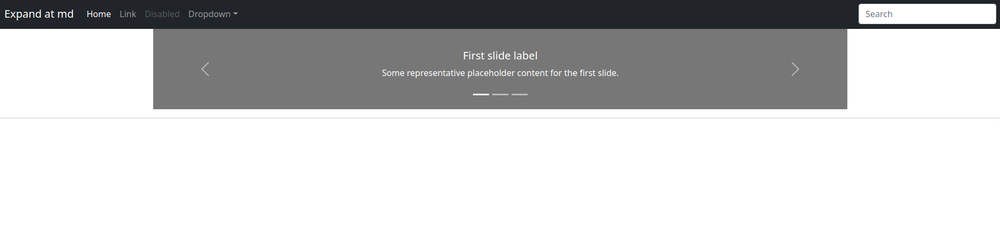

# Django 4 ile Uygulama Geliştirme 3
### 12. Yeni Sayfa Eklemek

Şimdi de menülerimizde yer alan sayfaları ekleyelim. Burada Yazarlar ve Yazar Bloglarımız dışındaki News uygulamamıza ait sayfaları ekliyoruz. Blog sayfamız News uygulamamız gibi bir uygulama olacak. ise Yazarlar ise yine ayrı bir uygulama olacak olan author (yazarlar) altında görünecek bir sayfa olacak.

Bunun için templates klasörüne alttaki sayfaları ekliyoruz.

- about-us.html
- contact-us.html
- hotline.html

Bütün sayfaların içeriğini de alttaki örnekteki gibi dolduruyoruz.

Sayfalarımıza üstten margin ve padding bırakıyoruz. Detaylar için şu linkden faydalanabilirsiniz.

https://getbootstrap.com/docs/5.1/utilities/spacing/

```python



<main class="container-lg">
    <h3> Hakkımızda </h3>
 <hr class="featurette-divider">

</main>


```
Bu sayfaları daha sonra news uygulamamız altındaki views.py dosyasına alttaki gibi ekliyoruz.

```python
from django.shortcuts import render, HttpResponse

# Create your views here.

def index(request):
    return render(request, "index.html")

def aboutus(request):
    return render(request, "about-us.html")

def contactus(request):
    return render(request, "contact-us.html")

def hotline(request):
    return render(request, "hotline.html")
```

Son olarak news_project klasörümüzdeki urls.py dosyamıza yeni sayfaları ekliyoruz.

```python
from django.contrib import admin
from django.urls import path
from news import views


urlpatterns = [
    path('admin/', admin.site.urls),
    path('', views.index, name='index'),
    path('about-us/', views.aboutus, name='aboutus'),
    path('contact-us/', views.contactus, name='contactus'),
    path('hotline/', views.hotline, name='hotline'),
]

```

Bu işlemlerde sonra artık html üzerinde kullandığımız URL'ler için dinamik url kullanabiliriz.

Html dosyamızda menüde kullandığımız likleri urls.py dosyasında oluşturğumuz URLlere verdiğimiz isimlerle de çağırabililiriz.
- Biz Kimiz? : 
- İletişim : 
- Ana sayfa : 

Örnek olarak navbar.html dosyamızdaki bir bölümü aşağıda görebilirsiniz

```html

<li class="nav-item">
  <a class="nav-link active" aria-current="page" href="">Ana sayfa</a>
</li>
<li class="nav-item">
  <a class="nav-link" href="">Biz Kimiz?</a>
</li>
```
Konu ile ilgili olarak alttaki linki ziyaret edebilirsiniz.

- https://docs.djangoproject.com/en/4.0/topics/http/urls/


### 13. Django Üzerinden Templates Dosyalarımıza İçerik (context) Göndermek

Bunun için templates klasörümüze context-test.html adında bir dosya oluşturuyoruz ve içeriğini about-us.html den kopyalarak H3 tagı içine içerik test yazıyoruz.

Sayfamızın rouing işlemleri için news_project klasörü altındaki urls.py dosyasını alttaki gibi değiştiriyoruz.

```python

from django.contrib import admin
from django.urls import path
from news import views


urlpatterns = [
    path('admin/', admin.site.urls),
    path('', views.index, name='index'),
    path('about-us/', views.aboutus, name='aboutus'),
    path('contact-us/', views.contactus, name='contactus'),
    path('hotline/', views.hotline, name='hotline'),
    path('context-test/', views.contexttest, name='contexttest'),

]

```
News uygulamamız içinde yeni bir view fonksiyonu ekliyoruz ve içeriğini alttaki gibi değiştiriyoruz.

```python

def contexttest(request):
    context = {
        "yazar1":{"ad":"murat cabuk 1"},
        "yazar2": {"ad": "murat cabuk 2"},
        "yazar3": {"ad": "murat cabuk 3"},
        "yazar4": {"ad": "murat cabuk 4"},
        "yazar5": {"ad": "murat cabuk 5"},
        "listem":[1,2,3,4,5,6]

    }
    return render(request, "context-test.html", context=context)


```
context-test.html dosyasını da alttaki gibi değiştiriyoruz.

detaylar için linkler
- https://docs.djangoproject.com/en/4.0/ref/templates/language/
- https://docs.djangoproject.com/en/4.0/ref/templates/api/
- https://docs.djangoproject.com/en/4.0/ref/templates/builtins/

| (pipe) işaretiden sonra kullanılan length bir filter. Konu ile alaklı hemen üstteki linklere bakablirsiniz.

```html



<main class="container-lg mt-3">
    <h3> İçerik Test </h3>
 <hr class="featurette-divider">


    <ul>

    

        
            <ul>
                <li>{{ i }}</li>
            </ul>
        
    
        <li>{{ item }}</li>
    
    </ul>

 <hr class="featurette-divider">
    {{ yazar1.ad }}
 <hr class="featurette-divider">
</main>



```
Daha sonra şu adrese (http://localhost:8000/context-test/) gittiğimizde aşağıdaki gibi sayfa görüyor olmamız lazım.



### 14. News Uygulamamızın URL'lerini Düzenlemek

Sayfamızda news ugulamamıza özel linklerin browser'da adres kısmında ayrıştırlabilmesi gerekiyor. Ayrıca her uygulamanın kendine ait URL'leri kendi içinde durması ana url.py dosyasını da sade tutacaktır.

Bunun için öncelikle news uygulamamız içine urls.py dosyası oluşturuyoruz.

```python
from django.urls import path
from news import views

app_name="news"

urlpatterns = [
    path('index/', views.index, name="news.index"), # ansayfa indexi ile news/index i
                                               # aynı sayfayı sogtereccek şekilde ayarlamış olduk.
                                               # buya ileride news/create, news/detail vb sayfalarda gelecek
    path('', views.index, name="news.empty"),
]
```

Daha sonra news_project klasörümüzdeki urls.py dosyasını da aşağıdaki gibi değiştiriyoruz. include module'ünü de eklediğimize dikkat edin.

```python

from django.contrib import admin
from django.urls import path, include
from news import views

urlpatterns = [
    path('admin/', admin.site.urls),
    path('', views.index, name='index'),
    path('about-us/', views.aboutus, name='aboutus'),
    path('contact-us/', views.contactus, name='contactus'),
    path('hotline/', views.hotline, name='hotline'),
    path('context-test/', views.contexttest, name='contexttest'),
    path('news/', include("news.urls"), name='news'),
]
```

Artık news uygulamamızı ana sayfasına alttaki linkerden ulaşabiliriz.
- http://127.0.0.1:8000/news/index
- http://127.0.0.1:8000/news
- http://127.0.0.1:8000


### 15. Sayfalarımıza Parametre Geçmek, Dinamik URL Oluşturmak

Bununla alakalı ilerde örneklerimiz olacak burada sadece basit test yapacağız.

Bunun için templates klasörümüze dynamic-url-test.html adında bir dosya oluşturuyoruz. İçeriğini about-us.html dosyasında alabiliriz. 

Amacımız client'ın adres satırından gondereceği id parametresini html içinde göstermek.

```html




<main class="container-lg mt-3">
    <h3> Dinamik URL Oluşturmak </h3>
 <hr class="featurette-divider">

{{ id }}

</main>


```

News uygulamamız içindeki views.py dosyasına yeni bir fonksiyon ekliyoruz.

```python
def dynamicurltest(request,id):
    context = {"id":id}
    return render(request, "dynamic-url-test.html",context=context)

```

Ve news uygulamamız içindeki urls.py dosyasını da aşağıdaki gibi düzenliyoruz.

```python
from django.urls import path
from news import views

app_name="news"

urlpatterns = [
    path('index', views.index, name="news.index"), # ansayfa indexi ile news/index i
                                               # aynı sayfayı sogtereccek şekilde ayarlamış olduk.
                                               # buya ileride news/create, news/detail vb sayfalarda gelecek
    path('', views.index, name="news.empty"),
    path('dynamic-url-test/<int:id>', views.dynamicurltest, name="news.dynamicurltest"),
]
```

Sonuç olarak sayfamızı aşağıki linklerle çağırabiliriz.
- http://127.0.0.1:8000/news/dynamic-url-test/300
- http://127.0.0.1:8000/news/dynamic-url-test/1
- http://127.0.0.1:8000/news/dynamic-url-test/4
- vb
