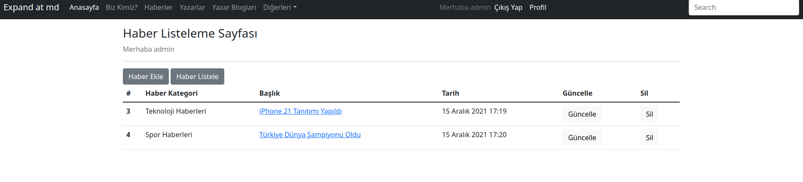

# Django 4 ile Uygulama Geliştirme 5
### 21. Haber Ekleme/Listeleme/Silme ve Güncelleme Sayfalarının Eklenmesi

- https://docs.djangoproject.com/en/4.0/ref/forms/models/
- https://docs.djangoproject.com/en/4.0/topics/forms/modelforms/
- https://stackoverflow.com/questions/33763452/applying-css-styles-to-form-items-in-django


Haber Kategorilerinin girişi admin panelinden yapılıyo olacak. Bunu yapabilek için ilgili yazarın admin paneline giriş yapma ve haber kategorilerini güncelleme izinlerinin olması gerkiyor bunu ileride göreğiz şimdilik admin yetkimizle admin paneli giriş yapıp bir kaçtane haber kategoris ekleyebiliriz.


**Profile sayfasına ilgili linkerlin eklenmesi**

Main tagları içinde en alta alttaki kodları ekliyoruz.

```html
<a class="btn btn-secondary" href="/news/add">Haber Ekle</a>
<a class="btn btn-secondary" href="/news/list">Haber Listele</a>

```


**Haberin Kaydedilmesi**

Bunun için templates klasörüne news adında bir klasör açarak içine add.html adında bir html dosyası ekliyoruz.

```html


<main class="container-lg mt-3">
    <h3> Haber Ekleme Sayfası </h3>
 
      <div class="text-secondary">
              Merhaba {{ request.user.username }}
      </div>

      
 <hr class="featurette-divider">
<a class="btn btn-secondary" href="/news/add">Haber Ekle</a>
<a class="btn btn-secondary" href="/news/list">Haber Listele</a>
 <hr class="featurette-divider">
  <form method="post">
    
    {{ form.as_p }}

        <button type="submit" class="btn btn-primary">Gönder</button>
    </form>
</main>

```
News uygulaması urls.py dosyasına alattaki URLleri ekliyoruz.

```python
    path('add', views.add, name="news.add"),
    path('list', views.list, name="news.list"),
```

News uygulamamıza forms.py dosyasını oluşturuyoruz ve modelform kodlarını aşağıdaki gibi ekliyoruz.

- https://docs.djangoproject.com/en/4.0/ref/forms/models/
- https://docs.djangoproject.com/en/4.0/topics/forms/modelforms/
- https://stackoverflow.com/questions/33763452/applying-css-styles-to-form-items-in-django

Görüldüğü üzere model hazır olduğu için bütün formu oluşturmuyoruz.

```python
from django.forms import ModelForm,TextInput, Select, Textarea
from .models import News

class NewsForm(ModelForm):
    class Meta:
        model = News
        fields = ['news_category_id', 'title', 'detail', ]
        widgets = {
            'news_category_id': Select(attrs={'class': 'form-control'}),
            'title': TextInput(attrs={'class': "form-control"}),
            'detail': Textarea(attrs={'class': 'form-control'}),
            }
```

Son olarak news uygulaması içindeki views.py dosyasına alttaki add fonksiyorunu ve gerekli import'ları ekliyoruz.

```python

from django.shortcuts import render, HttpResponse, redirect
from django.contrib import messages
from .forms import NewsForm

def add(request):
    form = NewsForm(request.POST or None)
    if form.is_valid():
        news = form.save(commit=False)
        news.author = request.user
        news.save()
        messages.success(request,"makale başarıyla kaydedildi.")
        return redirect("author:author.profile")

    return render(request, "news/add.html",{"form" : form})
```

**Haberin Listelenmesi**

- Django Queries: https://docs.djangoproject.com/en/4.0/topics/db/queries/
- Bootstrap'da table kullanımı için şu linke bakınız: https://getbootstrap.com/docs/5.0/content/tables/
- Bootsrap Grid ve Layour Sitemi için: https://getbootstrap.com/docs/5.0/layout/grid/


Haberleri listelemek için öncelikle templates klasörü altındaki news klasörüne list.html adında bir html dosyası ekliyoruz.

Listeme sayfasında haber başlıklarına detay sayfası için link verildiğine dikkat ediniz. Ayrıca silme ve düzenleme sayfaları için de satır sonlarına linkler eklendi. İleri de bunların da sayfalarını hazırlayacağız.

```html


<main class="container-lg mt-3">
    <h3> Haber Listeleme Sayfası </h3>
 
      <div class="text-secondary">
              Merhaba {{ request.user.username }}
      </div>
 
    <hr class="featurette-divider">

<a class="btn btn-secondary" href="/news/add">Haber Ekle</a>
<a class="btn btn-secondary" href="/news/list">Haber Listele</a>

    <table class="table table-hover">
        <thead>
        <tr>
          <th scope="col">#</th>
          <th scope="col">Haber Kategori</th>

          <th scope="col">Başlık</th>
          <th scope="col">Tarih</th>
          <th scope="col">Güncelle</th>
          <th scope="col">Sil</th>
        </tr>
        </thead>
        <tbody>
            
        <tr>
            <th scope="row">{{ news.id }}</th>
            <td>{{ news.news_category_id }}</td>
            <td><a href="/news/detail/{{ news.id }}"  class="link-primary"> {{ news.title }}</a></td>
            <td>{{ news.created_date }}</td>
            <td> <a href="/news/edit/{{ news.id }}" class="btn btn-light">Güncelle</a></td>
            <td><a href="/news/delete/{{ news.id }}" class="btn btn-light">Sil</a></td>
        </tr>
            
        </tbody>
    </table>
</main>

```

Listeleme için news uygulamamız altındaki urls.py dosyasına alttaki satırı ekliyoruz.


```python
    path('list', views.list, name="news.list"),
```

News uygulamamız altındaki views.py dosyasına alttaki satırları ekliyoruz. Burada dikkat edilirse sadece aktif yazara ait verileri çekmek için filtreleme fonksiyonu kullandık. Konu ile alakalı bilgi almak için alttaki linki ziyaret ediniz.

- https://docs.djangoproject.com/en/4.0/topics/db/queries/   

```python
def list(request):
    news=News.objects.filter(author=request.user)
    context = {
        "news":news
    }
    return render(request, "news/list.html",context=context)
```

http://localhost:8000/news/list adresine yada profil sayfasında, Haber Listeleme linkine tıklayacak olursak alttaki gibi bir sayfa görüyor olacağız.




**Haber Detay Sayfası**
- Bootsrap Grid ve Layour Sitemi için: https://getbootstrap.com/docs/5.0/layout/grid/

Haber detay sayfamız için teplates klasörü altındaki news klasörüne detail.html adında bir sayfa ekliyoruz.

```html



<main class="container-lg mt-3">

    <div class="row">
        <div class="col-9">
            <h3 class="h3"> {{ news.title }}</h3>

            <hr class="featurette-divider">
            {{ news.news_category_id }} / {{ news.author.first_name }} {{ news.author.last_name }} /
            {{ news.created_date }}
            <hr class="featurette-divider">

            {{ news.detail }}
        </div>
        <div class="col-3">
            <h3>Son Haberler</h3>
            <hr class="featurette-divider">
        </div>

    </div>


</main>


```

Daha sonra News uygulamamız altındaki urls.py dosyasına alttaki satırı ekliyoruz.
```python
    path('detail/<int:id>', views.detail, name="news.detail"),
```
Son olarak views.py dosyasına alttaki satırları ekliyoruz. 

```python
def detail(request,id):
    news = News.objects.filter(id=id).first() # get_object_or_404 fonksiyonu da kullanılabilirdi.
    context = {
        "news": news
    }
    return render(request, "news/detail.html", context=context)
```
Sonuç olarak profil ysayfasından herhangi bir haberin linkine tıklyacak olursak alttaki gibi bir sayfa görüyor olacağız.


İleride sayfamıza resim ve daha zengin detay metinleri koyacağız.


**Haber Düzenleme Sayfası**
- Bootsrap Grid ve Layour Sitemi için: https://getbootstrap.com/docs/5.0/layout/grid/

Haber düzenleme sayfamız için teplates klasörü altındaki news klasörüne edit.html adında bir sayfa ekliyoruz.

```html


<main class="container-lg mt-3">
    <h3> Haber Ekleme Sayfası </h3>
    
    <div class="text-secondary">
        Merhaba {{ request.user.username }}
    </div>

    
    <hr class="featurette-divider">
    <a class="btn btn-secondary" href="/news/add">Haber Ekle</a>
    <a class="btn btn-secondary" href="/news/list">Haber Listele</a>
    <hr class="featurette-divider">
    <form method="post">
        
        {{ form.as_p }}

        <button type="submit" class="btn btn-primary">Gönder</button>
    </form>
</main>

```

Daha sonra News uygulamamız altındaki urls.py dosyasına alttaki satırı ekliyoruz.
```python
    path('edit/<int:id>', views.edit, name="news.edit"),
```
Haber güncelleyebilmek için forms.py dosyasına bir şey eklememize gerek yok. İlgili dosyada yeralan NewsForm formu işimizi görecektir.

Son olarak views.py dosyasına alttaki satırları ekliyoruz. Burada dikkat edecek olursak get_object_or_404 adında bir fonksiyonun import edildiğini görebiliriz. Bu fonksiyon sayesinde tek bir kaydı veritabanında getirebiliriz. Eğer ilgili kayıt yoksa da sistem 404 sayfasına yönlencektir. Konu ilgili olarak alttaki linke bakabilirsiniz.

- https://docs.djangoproject.com/en/4.0/topics/http/shortcuts/#get-object-or-404

```python
from django.shortcuts import render, HttpResponse, redirect, get_object_or_404

def edit(request, id):
    news = get_object_or_404(News, id=id)
    form = NewsForm(request.POST or None, instance=news)

    if form.is_valid():
        news = form.save(commit=False)
        news.author = request.user
        news.save()
        messages.success(request,"makale başarıyla değiştirildi.")
        return redirect("news:news.detail", str(id))

    return render(request,"news/edit.html", {"form":form})
```
Haber listeleme sayfasında herhangi bir haber başlığının sağında yer alan güncelle linklerinden birine tıklayarak haber düzenleme sayfasına ulaşabiliriz.

**Haber Silmek**

Haber silmek için News uygulamamız altındaki urls.py dosyasına alttaki satırı ekliyoruz.
```python
    path('delete/<int:id>', views.delete, name="news.delete"),
```

ve views.py dosyasına da alttaki satırları ekleyerek silme işlemlerimizi de tamamlıoruz.

```python
def delete(request,id):
    news = get_object_or_404(News, id=id)
    news.delete()
    messages.success(request,"Haber başarıyla silindi")
    return redirect("news:news.list")
```

Haber listeleme sayfamızda herhangi bir haberin sil linkine tıklayarak haberi silebiliriz.

### 22. Sayfalarımızı Güvenli Hale Getirmek

Haber ekleme, liteleme ve silme gibi sadece sistemimize giriş yapmış yazarların görmesi gereken linkler şuan misafir kullanıcılarımıza da açık. Bunu test etmek için örneğin http://localhost:8000/news/add adresini sistemden çıkış yaptıkan sonra tarayıcımızda açacak olursanız sayfanın geldiğini görebilirsiniz.

Bu durumu engelemek için login_required decorator'unu kullancağız. Konu ile ilgili olarak şu linki https://docs.djangoproject.com/en/4.0/topics/auth/default/#the-login-required-decorator ziyaret ediniz.

Örneğin az önce bahsettiğimiz haber ekleme sayfasının güvenli olabilmesi için news uygulması altındaki views.py dosyasındaki add fonksiyınun hemen üstüne @login_required decoator'unu ekleyip test edelim. Bu decorator'u eklemek için de "*from django.contrib.auth.decorators import login_required*" login_required decorator'unu import etmek zorundayız.

```python
from django.contrib.auth.decorators import login_required

@login_required(login_url="/author/login")
def add(request):
    ...
```
Bu çalışmayı güvenli olması gereken bütün view fonksiyonlarına eklemek gerekiyor.py
