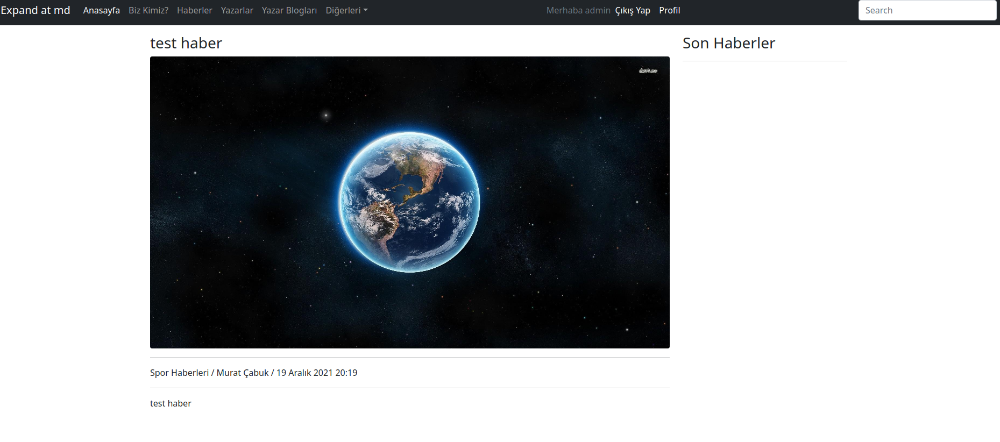
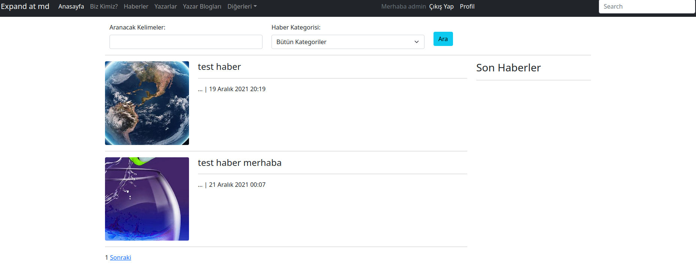

### 23. Haberlerimize Resim Eklemek
- https://docs.djangoproject.com/en/4.0/topics/http/file-uploads/
- https://stackabuse.com/handling-file-uploads-with-django/
- https://www.tutorialspoint.com/django/django_file_uploading.htm
- https://stackoverflow.com/questions/5871730/how-to-upload-a-file-in-django
- https://stackoverflow.com/questions/24373341/django-image-resizing-and-convert-before-upload
- https://docs.djangoproject.com/en/4.0/ref/validators


Öncelikle news modelimizi resim adresi alabilecek şekilde güncellememiz gerekiyor. Bunun için modelimize yeni bir alan ekleyip daha sonra migrate edeceğiz.

```python
class News(models.Model):
    id = models.BigAutoField(primary_key=True)
    news_category_id = models.ForeignKey(NewsCategory, on_delete=models.CASCADE, verbose_name="Haber Kategorisi")
    author = models.ForeignKey("auth.User", on_delete=models.CASCADE,  verbose_name="Yazar")
    title = models.CharField(max_length=255,  verbose_name="Başlık")
    detail = models.TextField( verbose_name="Haber Detayı")
    created_date=models.DateTimeField(auto_now_add=True, verbose_name="Oluşturulma Tarihi")
    
    # files klasöründe  images klasörü altında
    image_address = models.FileField(upload_to='images',blank=True, null=True, verbose_name="Haber Resmi", help_text="Maksimum 5MB resim seçiniz")


    def __str__(self):
        return self.title

    class Meta:
        verbose_name = "Haber"
        verbose_name_plural = "Haberler"

```
Modelimiz değiştiği için bunu Django'ya ve veritabanımıza söylememiz gerekiyor. Bunu için alttaki komutlatı sırasıyla çalıştırıyoruz.

```bash
python3 manage.py makemigrations
python3 manage.py migrate

```

settings.py dosyasında en alta alttaki satırları ekliyoruz.

```python

MEDIA_URL="/files/"
MEDIA_ROOT = os.path.join(BASE_DIR, 'files')

```
Yine settings.py dosyamızdaki TEMPLATES listesi içindeki  context_processors key'ine alttaki satır ekliyoruz.

```python
# django.template.context_processors.media

'context_processors': [
                'django.template.context_processors.debug',
                'django.template.context_processors.request',
                'django.contrib.auth.context_processors.auth',
                'django.contrib.messages.context_processors.messages',
                'django.template.context_processors.media',
            ],
```

Daha sonra news uygulamamızda urls.py dosyasına en üstte import bölümüne attaki satırları ekliyoruz.

```python
from django.conf import settings
from django.conf.urls.static import static
```

Ve yine urls.py dosyasında urlpatterns listesini alttaki satırı topluyoruz.

"static(settings.MEDIA_URL, document_root=settings.MEDIA_ROOT)"

```python
# static(settings.MEDIA_URL, document_root=settings.MEDIA_ROOT) bu satırı listeye topladık

urlpatterns = [
    path('index', views.index, name="news.index"), # ansayfa indexi ile news/index i
                                               # aynı sayfayı sogtereccek şekilde ayarlamış olduk.
                                               # buya ileride news/create, news/detail vb sayfalarda gelecek
    path('', views.index, name="news.empty"),
    path('dynamic-url-test/<int:id>', views.dynamicurltest, name="news.dynamicurltest"),
    path('add', views.add, name="news.add"),
    path('list', views.list, name="news.list"),
    path('edit/<int:id>', views.edit, name="news.edit"),
    path('delete/<int:id>', views.delete, name="news.delete"),
    path('detail/<int:id>', views.detail, name="news.detail"),
] + static(settings.MEDIA_URL, document_root=settings.MEDIA_ROOT)

```

Bu haliyle yeni bir haber oluşturup resim upload ettğimizde ana dizinde açmış olduğumuz files klasörü altındaki image klasöründe resmimizi görebiliriz.

Ancak bu noktada şuna dikkat etmeliyiz. Syafalarımızda haberleri bir çok yerde göstereceğiz ve gösterdiğimiz yerlerde faklı boyutlarda resimler göstereceğiz. Bu nedenle resimlerimizi farklı boyutlarda kaydetmemiz gerekiyor.

Bunun için pillow modülünü kullanacağız. Ancak öncelikle halen daha önce aktif ettiğimiz virtualenv'in aktif olduğundan emin olalım.

```shell
source django_env/bin/activate
```

daha sonra pip ile yükleyebiliriz

```python
pip3 install pillow
```


Öncelikle modelimizde aşağıdaki gibi bir değişiklik yapıyoruz.

- pillow modülünün import edildi
- pillow modülü sayesinde News class'ı içine save fonksiyonu override edilerek alınan resim jpeg formatında ve boyutu küçültülerek kaydedildi
- validation maodülünün import edilerek yeni eklenen image_address alanına belirli dosya uzantılarının kabül edilmesi sağlandı. Validation'ların  kullanımı hakkında şu adresten bilgi alabilirsiniz: https://docs.djangoproject.com/en/4.0/ref/validators
-  Delete fonksiyonu override edilerek news silinirken model üzerinden daha önce oluşturulan resimlerin silinmesi sağlandı

```python

from django.core.validators import FileExtensionValidator, MinValueValidator, RegexValidator

from PIL import Image as Img
from io import BytesIO
from django.core.files.uploadedfile import InMemoryUploadedFile
from django.core.files.storage import default_storage

class News(models.Model):
    id = models.BigAutoField(primary_key=True)
    news_category_id = models.ForeignKey(NewsCategory, on_delete=models.CASCADE, verbose_name="Haber Kategorisi")
    author = models.ForeignKey("auth.User", on_delete=models.CASCADE,  verbose_name="Yazar", validators=[MinValueValidator(3)])
    title = models.CharField(max_length=255,  verbose_name="Başlık")
    detail = models.TextField( verbose_name="Haber Detayı")
    created_date=models.DateTimeField(auto_now_add=True, verbose_name="Oluşturulma Tarihi")

    # files klasöründe  images klasörü altında
    image_address = models.FileField(upload_to='images',blank=True, null=True, verbose_name="Haber Resmi", help_text="Maksimum 5MB resim seçiniz", validators=[FileExtensionValidator(["jpg","jpeg","png"])])

    def save(self, *args, **kwargs):
        if self.image_address:
            image = Img.open(self.image_address)

            output = BytesIO()
            image.save(output, format='JPEG', quality=75)
            output.seek(0)

            image_name = str(uuid.uuid4().hex)
            self.image_address = InMemoryUploadedFile(output, 'ImageField', image_name+".jpg", 'image/jpeg',
                                              len(output.read()), None)


        super(News, self).save(*args, **kwargs)

    def delete (self, *args, **kwargs):
        image_address=self.image_address.path

        end = str(image_address).split("/")[-1].find(".jpg")
        file_name = str(image_address).split("/")[-1][0:end]

        end = str(image_address).find(file_name)
        file_path = str(image_address)[0:end]

        default_storage.delete(image_address)
        default_storage.delete(file_path + file_name + "_200x200.jpg")
        default_storage.delete(file_path + file_name +"_400x400.jpg")
        super(News, self).save(*args, **kwargs)


    def __str__(self):
        return self.title

    class Meta:
        verbose_name = "Haber"
        verbose_name_plural = "Haberler"

```

Daha sonra view üzerinde add fonskriyonu üzerinde alttaki değişiklikleri yapıyoruz.

- pillow modülünü import ediyoruz
- Haber kaydederken oluşturmak istediğimiz resimler için __resim_kaydet adında bir private fonksiyon ekliyoruz. İstediğimiz boyutlarda resim kayndetmek için bu fonksiyonu kullancağız. Bu fonksiyon oluşturmak isteğimiz resmi orjinal resmin tam ortasından  isteğimiz boyuttaki bölümü kopyalayarak yeni resim oluşturuyor. Şuan test amaçlı 200x200 ve 400x400 resimler oluituruyoruz ancak sayflarımız yaptıkça ihtiyacımız olacak boyutları buraya ekliyor olacağız.

```python

from PIL import Image as Img

@login_required(login_url="/author/login")
def add(request):
    form = NewsForm(request.POST or None, request.FILES or None)
    if form.is_valid():
        news = form.save(commit=False)
        news.author = request.user
        news.save()
        messages.success(request,"makale başarıyla kaydedildi.")

        # farklı boyutlarda resim kaydetme başladı
        file_name = str(news.image_address.name).split("/")[1].split(".")[0]

        end = str(news.image_address.path).find(file_name)
        file_path = str(news.image_address.path)[0:end]

        image = Img.open(news.image_address.path)

        __resim_kaydet(image,file_path,file_name,200,200)
        __resim_kaydet(image,file_path,file_name,400,400)
        # farklı boyutlarda resim kaydetme başladı


        return redirect("author:author.profile")

    return render(request, "news/add.html",{"form" : form})


def __resim_kaydet(image, file_path, file_name, new_width, new_height):

    width, height = image.size  # Get dimensions

    left = round((width - new_width) / 2)
    top = round((height - new_height) / 2)
    x_right = round(width - new_width) - left
    x_bottom = round(height - new_height) - top
    right = width - x_right
    bottom = height - x_bottom

    # Crop the center of the image
    image = image.crop((left, top, right, bottom))

    image_size = "_" + str(new_width) + "x" + str(new_height) + ".jpg"
    image.save(file_path + file_name + image_size, format='JPEG', quality=75)
```

Artık test edebiliriz. Haber ekledikten sontra files klasörü altındaki image klasöründe resimlerin oluştuğunu ve silme yaptığınızda  da oluşturulan bütün resmilerin silindiğini görebilirsiniz.

Artık haber detay sayfamıza resim ekleyebiliriz.

Bunun iiçin templates altındaki news klasöründe yer alan detail.html sayfasında h3 başlığının altına img tagımızı alttaki gibi ekliyoruz.

Adresi eklerken ../files şekilde eklememizin sebebi detail.html sayfamızın doğrudan templates klasörü altında olmaması. Bir alt dizin olan news dizininde olmasından dolayı relative path olarak bir üst dizini gösteriyoruz.

```html
 <h3 class="h3"> {{ news.title }}</h3>

        
```

Resim ekleme kodlarımızdan sonra eklediğimiz bir haberin detay sayfasına gittiğimizde alttaki gibi bir tasarım görüyor olacağız.


### 24. Haberlerin Detay Metinleri İçin Zengin Metin Özelliği (CKEditör) Eklemek
- https://django-ckeditor.readthedocs.io/en/latest/

Bunun için django-ckeditor modülünü kullanacağız. Ancak öncelikle halen daha önce aktif ettiğimiz virtualenv'in aktif olduğundan emin olalım.

```shell
source django_env/bin/activate
```

daha sonra pip ile yükleyebiliriz

```python
pip3 install django-ckeditor
```

daha sonra ckeditor uygulamasını settings.py dosyasındaki INSTALLED_APPS değişkenine ekliyoruz.

```python
INSTALLED_APPS = [
    'django.contrib.admin',
    'django.contrib.auth',
    'django.contrib.contenttypes',
    'django.contrib.sessions',
    'django.contrib.messages',
    'django.contrib.staticfiles',
    'news', "author", "ckeditor"
]
```

Daha sonra ckeditor'un statik dosyalarının static klasörüne eklenmesini sağlamak için alltaki komutu çalıştıracağız. Ancak komutu çalıştırmadan önce setting.py dosyamızdaki STATIFILES_DIRS listesindeki **os.path.join(BASE_DIR, "static"),** satırını açıklama satırına çeviyoruz. Daha sonra **STATIC_ROOT = os.path.join(BASE_DIR, 'static')** satırını ekliyoruz. Bunu yapma sebebimiz ckeditor STATIC_ROOT değikeninne bakıyor ancak bu zaten STATICFILES_DIRS tanımlı olduğu içinde hata veryor olması. İşimiz bitince STATIC_ROOT'u açıklama satırına çevirip liste içindeki satırı açıklma satırından çıkaraağız.

Yani aşağıdaki değişikliği yapmış olduk.

```python
STATICFILES_DIRS = [
   #os.path.join(BASE_DIR, "static"),
]

STATIC_ROOT = os.path.join(BASE_DIR, 'static')
```

Daha sonra alttaki komuyu çalıştırdık.Static klasörüne girip bakaak olursak ckeditor'un doylarının oluşturulduğunu görebiliriz.


```bash
python3 maanage.py collectstatic

```
Setting.py soyasını tekrar eski haline alıyoruz.


```python
STATICFILES_DIRS = [
   os.path.join(BASE_DIR, "static"),
]

#STATIC_ROOT = os.path.join(BASE_DIR, 'static')
```

Daha sonra news uygulamamız latındaki model.py doyamıza ckeditor'ü import ediyoruz.

```python
from ckeditor.fields import RichTextField
```
Haber detay alanı için kullandığımız Textfield yerine artık RichTextField kullnabiliriz.

ilgili satırı değiştiriyoruz.

```python
# detail = models.TextField( verbose_name="Haber Detayı")

detail = RichTextField()
```

Ckeditor aktif olduğunda elimizle yaacağımız stillerin ve html taglarinin kaybomaması için settings.py dosyasına alttaki satırları ekliyoruz.

```python
CKEDITOR_CONFIGS = {
    "default": {
        "removePlugins": "stylesheetparser",
        "allowContent": True,
        "width": "100%"
    }
}
```

add ve edit sayfalarımızda form içinde ** {{ form.as_p }}** satırının üstüne ** {{ form.media }}** alanını ekiyoruz.


```python

    {{ form.media}}
    {{ form.as_p }}
```

Son olarak detail sayfasında haber detayşarını gçsteren alanda ckeditor ile gelen html taglarinin güvenlir olduğunu belirtmek için safe filterini kullanıyoruz.

```python
{{ news.detail | safe }}
```

Artık haber ekleme ve düzenlme sayfalarımızda daha zengin metinler kullanabiliriz.
### 25. Haberlere Arama ve Sayfalama Eklemek

- https://docs.djangoproject.com/en/4.0/ref/paginator/
- https://docs.djangoproject.com/en/4.0/topics/db/queries/
- https://stackoverflow.com/questions/20222457/django-building-a-queryset-with-q-objects

Öncelikle haberler sayfımızı kategori seçimine göre haberleri listeleyen bir yapıya getirelim. daha sonrada kayıtları her bir sayfada 2 kayıt getirecek şekilde güncelleyelim. Amacımız çğrenmek olduğu için test kaydı girmye vakit harcamayalım.

Bunun için navbar.html içindeki Haberler linkimizi /news/search olarka değiştirdikten sonra urls.py dosyamıza alttaki satırı ekliyoruz

```python
    path('search', views.search, name="news.search"),
```
Ardından view'ımıza search fonksiyonumuzu aşağıdaki gibi ekliyoruz. QuerySet'ler kullanıldığı ana kadar veritabanında işlem yapmazlar. Bu durumda biz veriyi kullanmaya başlayana kadar Django verileri database'den çekmeyecektir. 

https://docs.djangoproject.com/en/4.0/ref/models/querysets/#when-querysets-are-evaluated

```python
from django.db.models import Q
from django.core.paginator import Paginator # sayfalama içn gerekli modül


def search(request):
    news_title = request.GET.get("q")
    news_category_id = request.GET.get("cid")
    page_number = request.GET.get('p')

    news = []
    query = Q(None) # Q objesi ile Or ve AND gibi birbirine bağlı sorgular yazabiliyoruz.
    if news_title or news_category_id:
        if news_title:
            text_list = str(news_title).split(" ")
            query = Q(title__contains=text_list[-1])
            for text in text_list[:-1]:
                query |= Q(title__contains=text)
        if news_category_id:
            news_category_id = int(request.GET.get("cid"))
            query |= Q(news_category_id=news_category_id)

        news = News.objects.filter(query).distinct()

        if page_number == None:
            page_number=1

        paginator = Paginator(news, 2)  # her sayfada 2 kayıt göterecek şekilde ayarlamış olduk
        news = paginator.get_page(page_number) # news objemiz artık haberler dışında sayfalam ile ilgili verileri de tutuyor

    categories = NewsCategory.objects.all()

    context = {
        "news":news,
        "categories":categories,
        "q":news_title, # arama kelimelerini ve haber kategori'id sini sayfalama linklerinde kullanabilmek için sayfaya geri gönderiyoruz.
        "cid":news_category_id

    }
    return render(request, "news/search.html",context=context)

```
search.html sayfaımızı da aşağıdaki gibi kodluyoruz. Haber resimlerini 400x400 gosterdiğimize dikkat ediniz.

```html



    <main class="container-lg mt-3">


        <div class="container">
            <form action="/news/search" method="get">
                <div class="row">
                    <div class="col-12 col-md-4">
                        <label for="q" class="form-label">Aranacak Kelimeler:</label>
                        <input id="q" name="q" type="text" class="form-control">
                    </div>
                    <div class="col-12 col-md-4">
                        <label for="q" class="form-label">Haber Kategorisi:</label>
                        <select id="cid" name="cid" class="form-select">
                            <option value="0">Bütün Kategoriler</option>
                            
                                <option value="{{ cat.id }}">{{ cat.title }}</option>
                            

                        </select>
                    </div>
                    <div class="col-12 col-md-4"><br>
                        <button type="submit" class="btn btn-info">Ara</button>
                    </div>

                </div>
            </form>

        </div>

        <hr class="featurette-divider">

        <div class="row">
            <div class="col-9">
                
                    
                        <div class="row">
                            <div class="col-3">
                                
                            </div>
                            <div class="col-9">
                                <h4 class="h4">{{ news.title }}</h4>
                                <hr class="featurette-divider">
                                <span>{{ news.desc | truncatewords_html:10 }} ...</span> |
                                <span>{{ news.created_date }}</span>

                            </div>
                        </div>
                        <hr class="featurette-divider">
                    
                
                    <span class="text-danger">Arama sonucunda kayır bulunamamıştır.</span>
                
            </div>
            <div class="col-3">
                <h3>Son Haberler</h3>
                <hr class="featurette-divider">
            </div>

        </div>
<!--sayfalama-->
        <div class="pagination">
    <span class="step-links">
        
            <a href="?p={{ news.previous_page_number }}&q={{ q }}&cid={{ cid }}">Önceki</a>
        

        <span class="current">
          {{ news.number }}
        </span>

        
            <a href="?p={{ news.next_page_number }}&q={{ q }}&cid={{ cid }}">Sonraki</a>
        
    </span>
        </div>


    </main>



```
Sayfalarımızda sağ üstte yeralan aramayı da haberlerde arama yapacak şekilde ayarlamk için navbar.html dosyamında bu alanı aşağıdkai gibi değiştiriyoruz.

```html
    <form method="get" action="/news/search">
        <input id="q" name="q" class="form-control" type="text" placeholder="Search" aria-label="Search">
    </form>
```

arama sayfamızı test ettiğimizde alttaki gibi sayfa görüyor olmalıyız.




