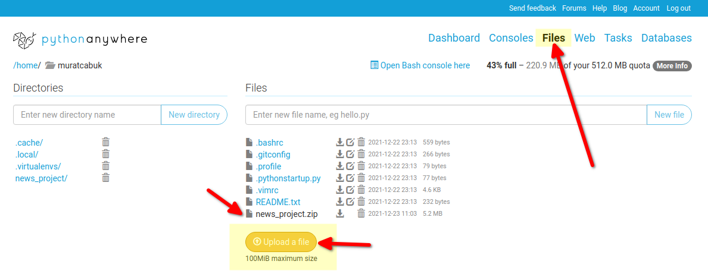
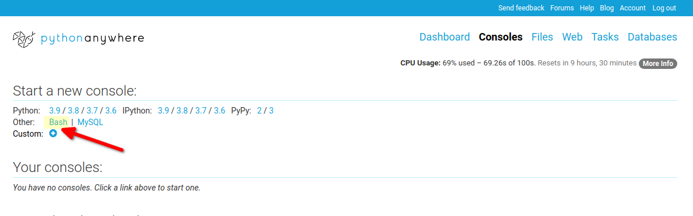
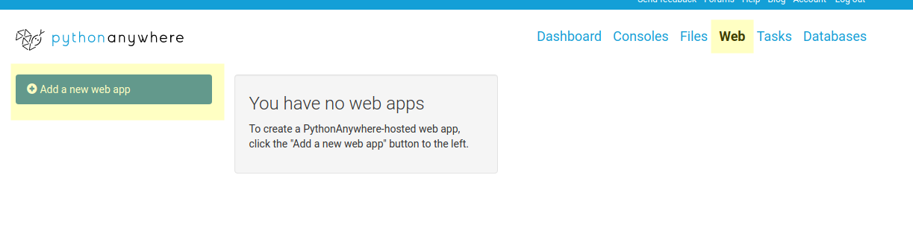
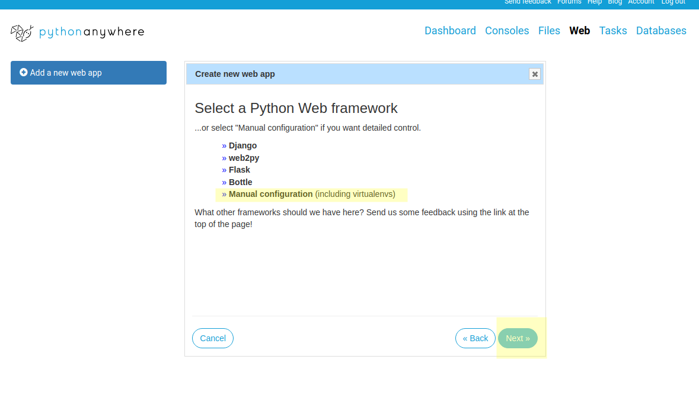
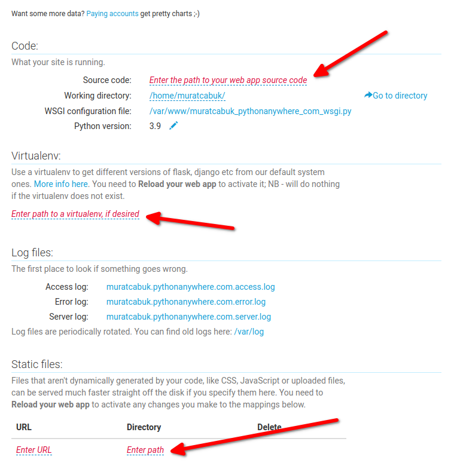
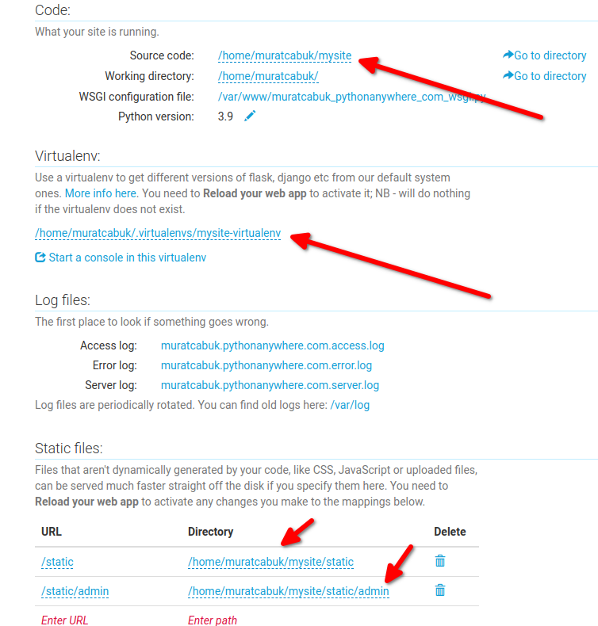
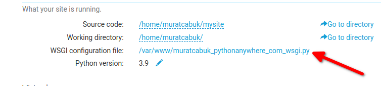
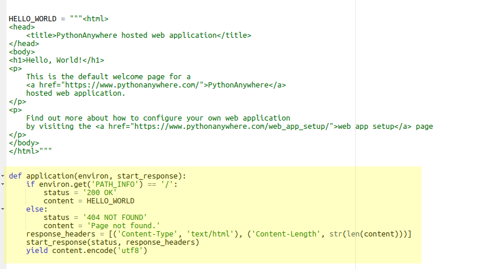
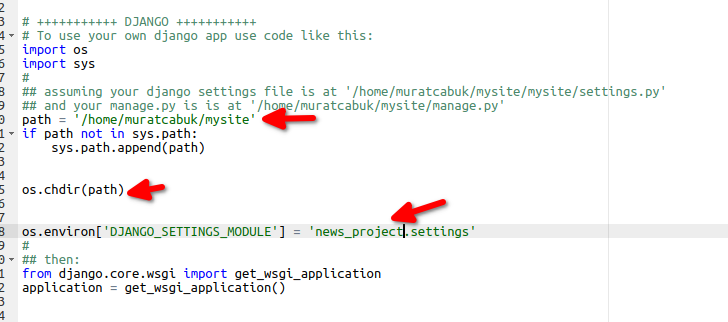

### 26. Django Uygulamamızı Yayına Vermek

Uygulamanızı bir bulut sistemine veya bir hosting firmasından alacağınız alana da deploy edebilirsiniz. 

Aşağıda global bulut sistemlerinin ilgili sayfalarına linkler ekledim. 

Python community'sinde en çok kullanılan hosting çözümlerinden biri herhalde pythonanywhere'dir. Biz siztemizi buranın ücretsiz verdiği hosting alanına deploy edeceğiz. 

- Amazon AWS Elastic Beanstalk üzerinde Django uygulama deploy etmek için : https://docs.aws.amazon.com/elasticbeanstalk/latest/dg/create-deploy-python-django.html
- Microsoft Azure Web App üzerinde Django uygulama deploy etmek için : https://docs.microsoft.com/en-us/azure/app-service/quickstart-python?tabs=bash&pivots=python-framework-django
- Google App Engine üzerinde Django uygulama deploy etmek için : https://cloud.google.com/python/django/appengine
- Digitalocean app platform üzerinde Django uygulama deploy etmek için :https://www.digitalocean.com/community/tutorials/how-to-deploy-django-to-app-platform
- Python anywhere üzerinde Django uygulama deploy etmek için : https://help.pythonanywhere.com/pages/DeployExistingDjangoProject/

Burada yaptığımız işlemler hemen hemen bütün firamlarda aynı şekilde aslıda sadece hesap açılışları ve kurulum yapacağımız sunucu üzerinde ufak teffek konfigürasyon farklıları olabilir. 

Herhangi birinde bu işlemi bir kez yaptığınızda diğelerilerinin de linklerini verdiğim dokümanlardan takip ederek yapabilirsiniz.

Ancak yinede yapacaklarımızı maddelere dökecek olursak,

- (eğer yoksa) uygulamamız için virtual environment oluşturacağız
- projemizi sunucuya yükleyeceğiz
- projemizdeki requirent'ları yükleyeceğiz
- kullandığımız hosting çözümünün istediği kendine özel konfigürasyonları yapacağız.


Öncelikle uygulamamız boyunca yüklediğimiz modülleri versiyonları ile birlikte projemizde saklamak için requirements.txt dosyamızı oluşturmalıyız. Uygulamamızın çalıştırılacağı ortamlarda yada başka bir ortamda development yapılacağı zaman hangi paketlere ihtiyacı olduğunu bilemmiz gerekiyor. Bunu için alttaki komutu kullanıyoruz requirements.txt dosyasmızı oluşturuyoruz.

```bash
pip3 freeze > requirements.txt 
```

https://www.pythonanywhere.com/ sitesine gidip bir hesap oluşturuyoruz ve plan olarak free versiyonu seçiyoruz.

Login olduktan sonra alttaki resimde görüleceği üzere files menüüsne gidiyoruz daha önce ziplediğimiz proje dosyamızı upload ediyoruz. Resimde daha önce upload etmiş olduğum news_project.zip dosyasını görebilirsiniz. Bu örnekte de mysite.zip olarak yeni bir dosya yükleyeceğim. Siz de komutları yazarken karşıştırmamak için aynı ismi kullanabilirsiniz zip dosyanızda. Normalde proje klasörümüzün adı news_project olduğu için eğer sizde benim gibi zip dosyanızın adına farklı bir isim vermek isterseniz news_project klasörünüzü başka bir yere kopğyalayıp adını değiştirdikten sonra zip dosyası olarak sıkıştırınız. Zip dosyasının adını değiştirmiş olmanız extract ettiğiniz klasör adını değiştirdiğiniz anlamına gelmiyor.



Daha sonra console tabına tıklayarak "bash" seçeneğine tıklıyoruz.



Karşımıza bir konsol ekranı gelecek bu ekranda alttaki komutla virtual environment'ı oluşturuyoruz

```bash
mkvirtualenv --python=/usr/bin/python3.9 mysite-virtualenv
```

Daha sonra upload ettiğimiz zip dosyasını açıyoruz.

```bash
unzip mysite.zip
```
daha sonra mysite kalsörümüze gidip requirement'larımızı yüklüyoruz.

```bash
cd mysite
pip3 install -r requirements.txt
```
daha sonra tarayıcıda başka bir tabda web menüsüne tıklıyoruz ve ardından açılan sayfada "add a new web" butonuna tıklayarak bir sonraki ekranda custom domain kullanamayacağımız hakkındaki uyarıya next diyerek geçiyoruz.



yeni gelen ekranda manuel konfigürasyon opsiyonunu seçiyoruz, ardında python 3.9'u seçiyoruz ve next diyoruz.



Son olarak artık karşımıza aşağıdaki bir sayfa öıkacak ve değiştirme istene 3 bölüm görüyor olacağız.



Bu alanları eğer yukarıda konsol kısmında benimle aynı içimleri kullanıysanız aşağıdaki gibi değiştiriyoruz.

source code = /home/muratcabuk/mysite
virtual environment path = /home/muratcabuk/.virtualenvs/mysite-virtualenv

static files path'leri
- /static = /home/muratcabuk/mysite/static
- /static/admin = /home/muratcabuk/mysite/static/admin



Geriye Wsgi dosyamızın ayarlanması işi kaldı.



Linke tıklıyoruz ve açılan sayfada aşağıdaki resimde görünen bloğu siliyoruz.



daha sonra biraz aşağıdaki Django yazan bölümdeki açıklma satırlarını kaldırarak aşağıdaki gölen değişiklikleri yapıyoruz.



Bu ekran da mysite yazan yerler fiziksel olarak uygulamamızı koyduğumuz dizin. kodu

Aşağıdaki satırda yazan news_project ise proje klasörümüzün içinde bulunan ve ve aynı zamanda Django proje adı olan klasörün adı. Yani mysite yazan yerler sizin projesnizde zip dosyanıza verdiğiniz isimle aynı olabilir yani benimkinden farklılık gösterebilir ancak bu alan aynı kalamk zorunda.

```python
os.environ['DJANGO_SETTINGS_MODULE'] = 'news_project.settings'
```

artık sağ üstten save butonuna tıklayarak ayarlarımızı kaydedebiliriz. Yine sağ üstten hambuterg menüye tıklayıp web linkine tıklayarak web ayarlarımız olduğu sayfaya dönebiliriz.

Bu sayfada en üstte Reload ve web sitenizin adı yazan butona tıklayarak ayarlarımızı alması için uygulamamı restart ediyoruz.

Artık sayfaımızı sayfamızı çağırdığımızda çalıştığını görebiliriz.

Eğer hata alacak olursanız daha önce oluşturduğunuz virtual environment'ları silmeyi unutmuş olabilirsiniz.Alttaki dizinde bulabilirsiniz.

```
home/kullaniciadiniz/virtualenvs
```

Diğer bir problem konfigürasyonlarınız da olabilir, adımları tekrar kontrol edediniz.


settings.py dosyaınızda ALLOWED_HOSTS değişkeninize domaininizi eklememiş olabilirsiniz. Şimdilik eğitim amaçlı bütün domainlere izin verebilirsiniz.

```
ALLOWED_HOSTS = ['*']
```

### 27. Bundan Sonra Ne Öğrenmeliyim?
- Transaction : https://docs.djangoproject.com/en/4.0/topics/db/transactions/
- Async/Await: https://docs.djangoproject.com/en/4.0/topics/async/
- Birden fazla tablo ile ilişki içeren kayılarla ilgili sayfalar: https://docs.djangoproject.com/en/4.0/topics/db/queries/
- Django ile API tabanlı uygulama geliştirme: https://github.com/encode/django-rest-framework
- Token tabanlı güvenlik: https://www.django-rest-framework.org/api-guide/authentication/
- Admin panelinin tasarımsal olarak özelleştirilmesi: 
  - https://realpython.com/customize-django-admin-python/
  - https://docs.djangoproject.com/en/4.0/ref/contrib/admin/#overriding-admin-templates
  - https://grappelliproject.com/
- Çok kültürlü (multicultural) web sitesi geliştirme:
  - https://docs.djangoproject.com/en/4.0/topics/i18n/
  - https://medium.com/fueled-engineering/becoming-a-multilingual-super-hero-in-django-part-2-b509a3f2f4a0
- Django Slug Kullanımı (user fiendly - SEO url): 
  - https://kodnito.com/posts/slugify-urls-django/
  - https://dev.to/danielfeldroy/django-slug-id-url-design-3l8b
  - https://vegibit.com/slug-based-routing-in-django/
  - https://learndjango.com/tutorials/django-slug-tutorial 


### 28. Genel Kaynaklar
- https://docs.djangoproject.com/en/4.0/topics/
- https://docs.djangoproject.com/en/4.0/
- https://developer.mozilla.org/en-US/docs/Learn/Server-side/Django