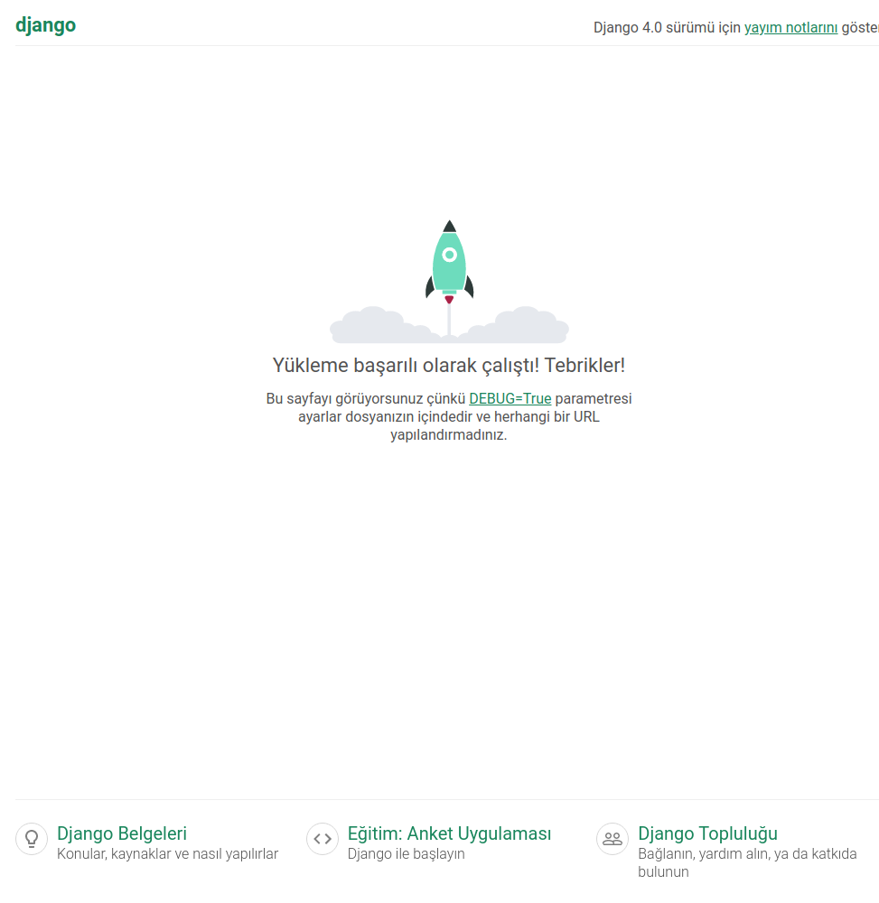
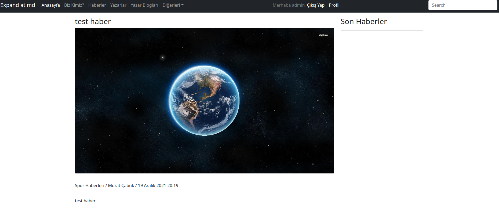
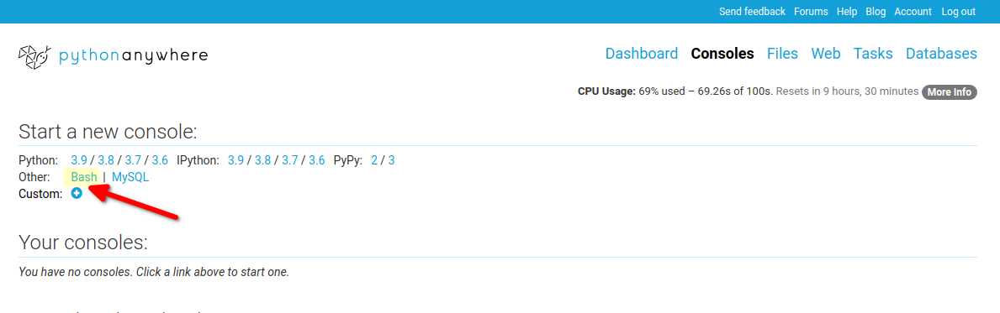
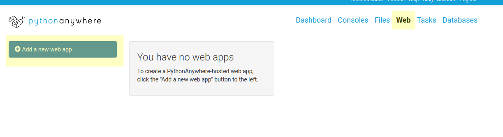
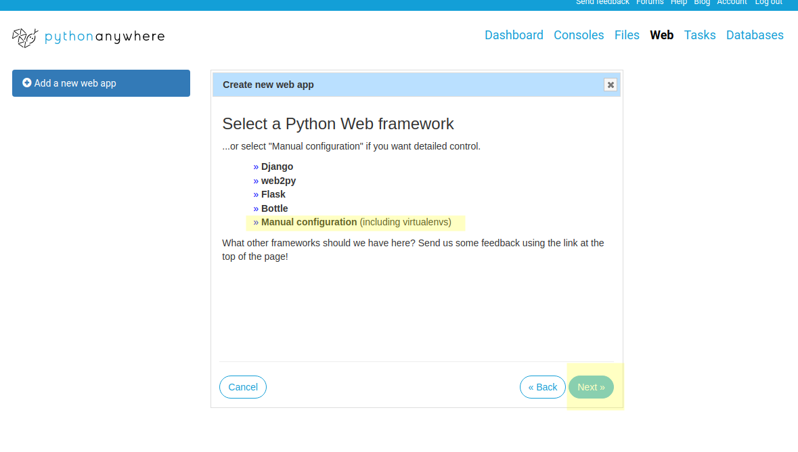
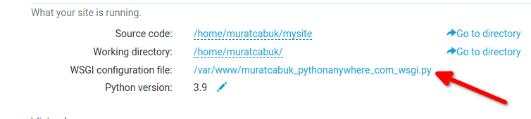
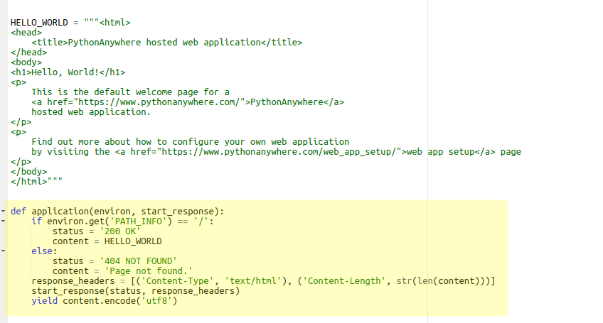

### 1. Başlamadan Önce

Merhabalar,

Bu makale serimizde amacımız Python Django Framework'ünü öğrenemeye çalışacağız. Django bir backend we uygulama geliştirme framework'üdür. Backend framework'lerinin tamamını temel amacı sunucu tarafında dinamik html kodları oluşturmatır diyebiliriz. 

Django öğrenemeye başlamak ve bu makalede yazanları da anlayabilmek için

- orta seviye python,
- orta seviye html ve css,
- orta seviye sql,
- ve http'nin nasıl çalıştığına dair biraz araştırma

yeterli olacaktır. Eğer bu başlıklar hakkında bir fikriniz yoksa makale serisini anlama konusun da problem yaşayabilirsiniz.

Peki neler öğrenceğiz?

- Proje ve uygulama oluşturma
- Admin sayfalarının özelleştrilmesi
- Statik dosyaların yönetimi
- Sunucuya dosya yükleme ve silme
- Yüklenen resimlerin farklı boyutlarda oluşturulması
- ORM ve veritabanı migration
- Boostrap 5'in Django template'lerinde kullanımı
- Django uygulamının yaynlanması (deployment)

Makalenin sonunda daha fazlası için neler öğrenmeniz gerektiği ve bakmanız gereken kaynakları da içeren bir başlık var. Bu bölüm bir anlamda bu makale dizisinde eksik bırakılan yerleri de göstermekdir. Daha kaliteli yazılım geliştirmek için bu bölümdeki konu başlıklarını da hedeflerinize mutlaka ekleyiniz.

Bütün bölüm başlarında kullanılan kaynakların linkleri bulunmaktadır. İlgili başlıkla alakalı daha fazla bilgi almak için faydalanabilirsiniz. Ayrıca karşılaşağınız hatalarala alakalı da bu kaynakları kullnabilirsiniz.

Her türlü sorunuzu makale altına yazabilirsiniz. Kendim cevaplayamasam bile bir başka arkadaşımız destek olabilir. Özellikler hata ve eksikleri yazarsanız kodları ve makaleyi düzeltebiliriz böylece yeni başlayan herkese yardımcı olmuş olursunuz.

Eğer ilk kez Django öğreniyorsanız sabırlı olun, çok fazla hata yapacasınız muhtemelen bu sizi yıldırmasın. Kodu tekar ilk halien alıp tekrar deneyin. Hatayı hemen birine sormak yerine kendiniz çözmeye çalışın. Kendi kendinize öğreneme yeteneklerinizi gelitirmenin en iyi yollarından biri doğrudan sormak yerine araitırmaktır. Büyük ihtimalle aynı hatayı ilk yaşayan siz değilsiniz. Forumlarda probleminizle alakalı cevap bulabilirsiniz. Tüm yolları tükettikten sonra doğrudan bir bilene sormak sizin için faydalı olacaktır.

Uygulamanın bitmiş kodlarını github sayfamda bulabilirsiniz. Admin paneli için kullanıcı adı "admin" ve şifre "Abc-123!".

Umarım faydalı olur. İyi okumalar.
### 2. Kurulum

virtualenv kullanılarak virtual environment oluşturuldu.


```shell
virtualenv django_env
source django_env/bin/activate
pip3 install Django==4.0

django-admin --version
# 4.0

# veya 

python3 -m django --version
# 4.0

```

Yada alttaki gibi django module olarka kullaılarak da verdion konrol yapılabilir. 

```python

import django
print(django.get_version())
# 4.0


```

Alltakki grafiği makaleler boyunda arada sırada gelip kontrol ediniz. Django'nun çalışma mantığını, hangi dosyanın ne için kullanıldığını çok badit bir şekilde ifade etmiş.


### 3. Proje oluşturmak

```shell

# proje oluşturduk
django-admin startproject news_project
cd news_project 
# burada oluşan manage.py ile bütün django ihtiyaçlarımızı karşılayaağız. yeni bir app'e ihtiyacımız olduğunda veya konfigürasyonda değişiklik yapma istedğimizde sık sık bu modülü kullanıyor olacağız.

# news adında bir app oluşturduk
python3 manage.py startapp news

```

bu uyuglamayı daha sonra ayağa kaldırıp kullanacağız.


news_project klasörü altındaki settings.py dosyasına bakacak olursak 'INSTALLED_APPS' adında bir değişken görünecek. Bu değişkende Django tarafınfdan yüklenen app lerin listesi görülmektdir.

```python
INSTALLED_APPS = [
    'django.contrib.admin',
    'django.contrib.auth',
    'django.contrib.contenttypes',
    'django.contrib.sessions',
    'django.contrib.messages',
    'django.contrib.staticfiles',
]
```
aynı dosya altında middleware'lar da görülebilir.

```python
MIDDLEWARE = [
    'django.middleware.security.SecurityMiddleware',
    'django.contrib.sessions.middleware.SessionMiddleware',
    'django.middleware.common.CommonMiddleware',
    'django.middleware.csrf.CsrfViewMiddleware',
    'django.contrib.auth.middleware.AuthenticationMiddleware',
    'django.contrib.messages.middleware.MessageMiddleware',
    'django.middleware.clickjacking.XFrameOptionsMiddleware',
]
```

aynı dosyada veritabanı bilgilerine de ulaşılabilir

```python
DATABASES = {
    'default': {
        'ENGINE': 'django.db.backends.sqlite3',
        'NAME': BASE_DIR / 'db.sqlite3',
    }
}
```

static dosyların konulacağı adres 

```python
STATIC_URL = 'static/'
```

En önemli ayarlardan biri de internationalization ayarı. Normalde dil ayarı ingilizce ve saat dilim de UTC (Coordinated Universal Time) olarak ayarlıdır. 

```python

# Internationalization
# https://docs.djangoproject.com/en/4.0/topics/i18n/

LANGUAGE_CODE = 'en-us'

TIME_ZONE = 'UTC'

USE_I18N = True

USE_TZ = True

```
Burada dil ve saat ayarını doğru yapmamız geekiyor. üstteki bölümü aşağıdaki gibi değiştiriyoruz.

```python

LANGUAGE_CODE = 'tr'

TIME_ZONE = 'Europe/Istanbul'

USE_I18N = True

USE_TZ = True


```
- news_project klasöründeki diğer bir dosya ise [wsgi.py](https://wsgi.readthedocs.io/en/latest/what.html) dosyasıdır bu da python için geliştirilmiş bir http server'dır diyebiliriz basitçe. 
- [asgi.py](https://asgi.readthedocs.io/en/latest/introduction.html) dosyası ise wsgi'ın async kısımını tamamlar.
- urls.py ise routing işlemlerini yönetir.


artık uygulamamızı çalıştırmaya hazırız

```python

python manage.py runserver #buraya port yazarsan o porttan yayın yapar. default 8000 portu

# aşağıdakine benzer saatırlar görüyor olmamız gerekiyor.

# System check identified no issues (0 silenced).

# You have 18 unapplied migration(s). Your project may not work properly until you apply the migrations for app(s): admin, auth, contenttypes, sessions.
# Run 'python manage.py migrate' to apply them.
# December 11, 2021 - 21:09:25
# Django version 4.0, using settings 'news_project.settings'
# Starting development server at http://127.0.0.1:8000/
# Quit the server with CONTROL-C.
```

aiağıkine benzer bir sayfa görmemiz gerekiyor.


### 4. Admin Sayfasının Çalıştırılması

urls.py dosyasın bakacak olursak alttaki gibi bir blog görüyor olacağız.

```python
urlpatterns = [
    path('admin/', admin.site.urls),
]
```

Bu adresi browser'da çalıştırmayı denediğimizde karşımıza login sayfaı çıkacak. Sayfada kullanıcı adı ve şifreye rastgele biyşeyler yazıp girmeyi denediğimizde *no such table: auth_user* hatası alacağız. 

Yani admin işlemleri için gerekli olan tablolar henüz oluşturulmadığı için bu hatayı alıyoruz.

news_project klasörüne bakacak olursak db.sqlite3 diye bir dosyasının olduğunu görebiliriz. Bu dosyayı bir IDE (DB Browser for Sqlite) ile incelediğimizde tabloların olmadığı görülecektir.

Settings.py dosyası içinde geçen *django.contrib.admin* satırı bize django içinde default (varsayılan) uygulamalardan birinin de admin uygulması olduğu göstermektedir. İleride kendi uygulamarımızı da buraya ekleyeceğiz.

Şimdi bu admin uygulamasının verilerini ve tablolarını migration yaparak sqlite3 veritabanımızda oluşturalım.

Bu arada uygulamamızı ilk çalıştırdığımız 8000 portundan yayınlandığı esnada terminalimizde gelen mesajlardan biri de aşadaki gibiydi. Bu mesaj bize admin uygulamasının çalışmayacağını göstermektedir. Hatta bu sonu gidermek için de hangi komutu çalıştırmamız gerektiğini de söylüyor.

```python
# You have 18 unapplied migration(s). Your project may not work properly until you apply the migrations for app(s): admin, auth, contenttypes, sessions.

# Run 'python manage.py migrate' to apply them.
```

Şimdi bu migration'ları tamamlayalım. bunu için uygulamayı durdurmadan başka bir terminali de kullanabiliriz.

```bash
python3 manage.py migrate # windows için sadece python yazmamız yeterli 3 yazmaya gerek yok

# Operations to perform:
#   Apply all migrations: admin, auth, contenttypes, sessions
# Running migrations:
#   Applying contenttypes.0001_initial... OK
#   Applying auth.0001_initial... OK
#   Applying admin.0001_initial... OK
#   Applying admin.0002_logentry_remove_auto_add... OK
#   Applying admin.0003_logentry_add_action_flag_choices... OK
#   Applying contenttypes.0002_remove_content_type_name... OK
#   Applying auth.0002_alter_permission_name_max_length... OK
#   Applying auth.0003_alter_user_email_max_length... OK
#   Applying auth.0004_alter_user_username_opts... OK
#   Applying auth.0005_alter_user_last_login_null... OK
#   Applying auth.0006_require_contenttypes_0002... OK
#   Applying auth.0007_alter_validators_add_error_messages... OK
#   Applying auth.0008_alter_user_username_max_length... OK
#   Applying auth.0009_alter_user_last_name_max_length... OK
#   Applying auth.0010_alter_group_name_max_length... OK
#   Applying auth.0011_update_proxy_permissions... OK
#   Applying auth.0012_alter_user_first_name_max_length... OK
#   Applying sessions.0001_initial... OK
```

db.sqlite3 dosyasını tekrar açıp bakarsak içinin tablolarla dolduğunu görebiliriz.

Artık admin sayfasını tekrar çalıştırabiliriz. Giriş yapmak için yine rastgele username ve password yazıp sayfayı gönderdğimizde artık daha farklı bir hata alacağız. 

Şuan bir admin kullanıcımız yok bunu oluşturmak için alttaki komutu çalıştırıyoruz.

```bash
python3 manage.py createsuperuser
# kullanıcıadı: admin
# şifre Abc-123!
```

Artık giriş yapabiliriz. Giriş yaptığımızda karşımıza user'ları ve group'ları yöntebilceğimiz bir ekran çıkacak. Henüz bir app ayağa kaldırmağımız için başka bir şey göremiyoruz.
### 5. News Uygulamasının Oluşturulması

Daha önce news app'imizi oluşturmuştuk ancak oluşturmadıysanız alttaki komutla oluşturabilirsiniz.

```python
python3 manage.py startapp news
```
Proje klasörümüz içinde news adında bir klasör oluştuğunu göreceğiz.

News App'imiz altında veritabanı ve sayfa modellerimizi models.py dosyasına oluşturduktan sonra admin.py dosyasına register etmemiz gerekiyor.

Haberlerimizi kategorize edeceğimiz için iki adet modele ihtiyacımız olacak. Bunlardan biri  NewsCategory diğeri ise News olacak.

Bunun için models.py dosyamıza alttaki satırları ekliyoruz.

Modeller hakkında detaylı bilgi için : https://docs.djangoproject.com/en/4.0/topics/db/models/


```python

# https://docs.djangoproject.com/en/4.0/topics/db/models/
class NewsCategory(models.model):
    id = models.BigAutoField(primary_key=True)
    title = models.CharField(max_length=255)
    desc = models.TextField()
    created_date=models.DateTimeField(auto_now_add=True)


class News(models.model):
    id = models.BigAutoField(primary_key=True)
    news_category_id = models.ForeignKey(NewsCategory, on_delete=models.CASCADE)
    title = models.CharField(max_length=255)
    detail = models.TextField()
    created_date=models.DateTimeField(auto_now_add=True)
```

Daha sonra bu iki modelimizi admin.py dosyasına register ediyoruz.

Bunun için news app altındaki admin.py dosyasına alttaki satırarlı ekliyoruz.

```python
from .models import NewsCategory
from .models import News

admin.site.register(NewsCategory)
admin.site.register(News)
```

Ancak news uygulamasından henuz Django'nun haberi yok. Bu uygulamayı projemize göstermemiz gerekiyor. Bunun için news_project altındaki settings.py dosyasında INSTALLED_APPS değişkenine ekleme yapıyoruz.


```python
INSTALLED_APPS = [
    'django.contrib.admin',
    'django.contrib.auth',
    'django.contrib.contenttypes',
    'django.contrib.sessions',
    'django.contrib.messages',
    'django.contrib.staticfiles',
    'news'
]

```
Şimdi uygulamamızın migration işlemlerini halledelim. Oluşturduğumuz modellerin migration dosyalarının oluşturulması için alttaki kodları çalıştırıyoruz.

```bash
python3 manage.py makemigrations

# Migrations for 'news':
#   news/migrations/0001_initial.py
#     - Create model NewsCategory
#    - Create model News
```
İki adet model için news uygulaması altındaki migrations klasörüne 0001_initial.py dosyası oluşturulduğu yazıyor.

Bu dosya üzernden migration işlemini başlatabiliriz.


```bash

python3 manage.py migrate
# Operations to perform:
#   Apply all migrations: admin, auth, contenttypes, news, sessions
# Running migrations:
#   Applying news.0001_initial... OK
```


Artık admin sayfamıza gittiğimizde news ve news_category sayfalarının eklendiğini görebiliriz.

### 6. Admin sayfasını özelleştirmek


- https://docs.djangoproject.com/en/4.0/ref/contrib/admin/
- https://docs.djangoproject.com/en/4.0/ref/contrib/admin/
- https://github.com/cdrx/django-admin-menu
- https://www.geeksforgeeks.org/customize-django-admin-interface/

Admin sayfamızda görünen model ve sayfalarlar alakalaı özelleştirme yampmak mümkün bunun için admin modelleri kullanacağız.


Öncelikle news uygulamamızdaki modelleri Türkçeleştirelim. Bunun için news altındaki modelleri alttaki gibi değiştiriyoruz.

verbose_name parametersini doldurmuş olduk. Ayrıca \__str\__ fonksiyonunu yazarak listelem sayfalarında news object diye yazan kelimeyi başlıkla değiştirmiş olduk.

"class Meta" ile yonetim panelindeki menülerde de Türkçe görünmesini sağlamış olduk.


```python

class NewsCategory(models.Model):
    id = models.BigAutoField(primary_key=True)
    author = models.ForeignKey("auth.User", on_delete=models.CASCADE, verbose_name="Yazar")
    title = models.CharField(max_length=255,  verbose_name="Başlık")
    desc = models.TextField( verbose_name="Açıklama")
    created_date=models.DateTimeField(auto_now_add=True,  verbose_name="Oluşturulma Tarihi")

    def __str__(self):
        return self.title

    class Meta:
        verbose_name = "Haber Kategori"
        verbose_name_plural = "Haber Kategorileri"


class News(models.Model):
    id = models.BigAutoField(primary_key=True)
    news_category_id = models.ForeignKey(NewsCategory, on_delete=models.CASCADE, verbose_name="Haber Kategorisi")
    author = models.ForeignKey("auth.User", on_delete=models.CASCADE,  verbose_name="Yazar")
    title = models.CharField(max_length=255,  verbose_name="Başlık")
    detail = models.TextField( verbose_name="Haber Detayı")
    created_date=models.DateTimeField(auto_now_add=True, verbose_name="Oluşturulma Tarihi")

    def __str__(self):
        return self.title

    class Meta:
        verbose_name = "Haber"
        verbose_name_plural = "Haberler"
```

Bu işlemden sonra admin sayfamızı yenileyebiliriz. Ancak burada şuna dikkat edelim biz henüz admin sayfasını değil sadece news uygulaması altındaki 2 modülü Türkçeleştirdik. Bu modullerde form ekranlarında görülen lalanları Türkçeye çevirmiş oldu.

Şimdi admin sayfamızdaki görünen model dışındaki metinleri ve listedeleri özelleştirelim.

News uygulaması altındaki admin.py dosyası altında yapmış olduğumuz registration işlemlerini decorator versiyonu değiştirerek admin modellerimizi ekliyoruz.

list_display ile admin sayfasındaki listelerde hangi alanların (prooerty) gösterileceğini de belirtmiş oluyoruz.

Alttaki düzenlemeyi yaptıktan sonra sayfalarımız refresh yapabiliriz.

```python

from .models import NewsCategory
from .models import News

# admin.site.register(NewsCategory)
# admin.site.register(News)


@admin.register(News)
class NewsAdmin(admin.ModelAdmin):
    list_display = ["title", "author", "created_date"]

    class Meta:
        model = News


@admin.register(NewsCategory)
class NewsCategoryAdmin(admin.ModelAdmin):
    list_display = ["title", "author", "created_date"]

    class Meta:
        model = NewsCategory

```

Son olarak uygulamamızın (news) menülerde görünen adını da Türkçleştiriyoruz. Bunu için news uygulama latındaki apps.py dosyasını editliyoruz.

```python

class NewsConfig(AppConfig):
    default_auto_field = 'django.db.models.BigAutoField'
    name = 'news'
    verbose_name = "Haberler"
```
artık yönetim sayfamızda dolaştığımızda herşeyin düzeldiğini görebiliriz.

### 7. Django Shell Console Kullanımı

Yeni bir terminalde alttaki komutu kullanarak Django shell'e geçiş yapıyoruz.

```bash

python3 manage.py shell

```
Bu komutla birlikte shell'e geçiş yapıyoruz. Shell üzerinde prpjemizle alakalı bütün modüllere erişmek mümkün. **ORM** aracını kullanarak veritabanı sorguları yapmak, yeni kayıtlar oluşturmak veya değiştirmek mümkün. Biraz örnek yapalım

```python
from django.contrib.auth.models import User
from news.models import News
from news.models import NewsCategory

print(User)
#<class 'django.contrib.auth.models.User'>

print(News)
#<class 'news.models.News'>

newUser = User(username="muratcabuk")
newUser.set_password("Abc-123!")
newUser.save() # kullanıyı check edecek olursak verştabanında görebiliriz.
# ayrıca kullanıcıyı yonetim paneli üzerinde görebiliriz ve editleyebiliriz.

newNewsCat = NewsCategory(title="test kategori", desc = "test kategori", author = newUser)
newNewsCat.save() # daha sonra gidip yönetim panelinden kntrol edecek olursak kategorini oluşturulduğunu görebiliriz

oldNewsCat = NewsCategory.objects.get(id=2)

print(oldNewsCat)

# test kategori 2

oldNewsCat.title = "test kategori 2 değişti"

oldNewsCat.save()

oldNewsCat = NewsCategory.objects.get(id=2)

print(oldNewsCat) # yönetim panelinden de check edilebilir.
# test kategori 2 değişti

```

### 8. Django URL ve Klasör Yapısı

- https://docs.djangoproject.com/en/4.0/topics/templates/
- https://docs.djangoproject.com/en/4.0/ref/templates/language/
- https://docs.djangoproject.com/en/4.0/ref/templates/builtins/

Django doğrudan jinja2 kullanmaz ona çok benzeyen kendi template sistemini kullanır ancak jinja2'yi de kullanmak mümkündür üstteki linkte detaylar görülebilir.

Ayrıca istenirse bizzat Python'ın kendisi de template içinde kullanılabilir. Bunun için en çok kullanılan modüllerden birinin linkini aşağıda bulabilirsiniz. Reddit bu template dilini kullanılarak oluşturulmuş bir web sitesi.

- https://docs.makotemplates.org/en/latest/

Öncelikle sayfamızda kullanacağımız template ve diğer statik dosyaların nereye konulduğunu projemize göstermemiz gerekiyor.

Bunun için news_project klasörü altındaki settings.py dosyasındaki TEMPLATES değişkenindeki DIRS key'ine ana dizine yani news_project klasçrünün bir üst dizinine açmış olduğumuz templates klasörünü ekliyoruz.

```python

TEMPLATES = [
    {
        'BACKEND': 'django.template.backends.django.DjangoTemplates',
        'DIRS': ["templates"], # burayı eklemiş olduk
        'APP_DIRS': True,
        'OPTIONS': {
            'context_processors': [
                'django.template.context_processors.debug',
                'django.template.context_processors.request',
                'django.contrib.auth.context_processors.auth',
                'django.contrib.messages.context_processors.messages',
            ],
        },
    },
]
```
Daha sonra bu klasöre anasayfa için bir index.html ekliyoruz.

Sıra geldi url ve routing'lerimi düzenlemeye. Bunun için news_project klasörümüz altındaki  urls.py dosyamızı açıyoruz ve alttaki düzenlemeyi yapıyoruz.

Öncelikle importlara birazdan news altındaki views'lere yazacağımız index fonskiyonunu ekliyoruz. 

```python
from django.contrib import admin
from django.urls import path
from news.views import index


urlpatterns = [
    path('admin/', admin.site.urls),
    path('', index),
]
```
Daha sonra bu routing'e cevap vermesi için news klasörü altındaki views.py dosyasına aşağıdaki fonksiyonu ekliyoruz.Ayrıca en üste HttpResponse modülünü de import ediyoruz. Şuan templates klasörü altındaki index.html'yi çağırmadan ekrana basit bir mesaj yazmak i.in "merhaba dünya" diyoruz.

Aşağıda default olarak gelen function based views kullanılıyor. birde class based view kullanımı var detaylar için alttaki linki kullanabilirsiniz.

- https://docs.djangoproject.com/en/4.0/topics/class-based-views/intro/

```python
from django.shortcuts import render, HttpResponse

# Create your views here.

def index(request):
    return HttpResponse("<h3>Merhaba Dünya</h3>")
```

Uygulamamız çalışmıyorsa alttaki komutla çalıştırabiliriz. Anasayfaya gittiğimizde merhaba dünya yazdığını görebiliriz.

```bash
python3 manage.py runserver
```

Şimdi index.html template'imizi render ettirebiliriz. news altındaki views.py doyasımızdaki index fonksiyonunu aşağıdaki gibi değiştiriyoruz.

```python

def index(request):
    return render(request, "index.html")

```
Daha sonra sayfamızı refresh ettiğimizde index.html dosyamızın içeriğinin geldiğini görebiliriz.

Ancak burada şöyle bir gariplik var. Anasayfayı istemiş olduk URL'den ancak News uygulamamızın anasayfasına yönlendirmiş olduk.

Bu durumu düzeltmek için templates klasörüne news diye bir klasör açıyoruz ve bir index.html doyası da onun içine ekliyoruz. İçine news uygulamasının çağrıldığını göstermek için "merhaba news uygulmasına hoşgeldiniz." yazıyoruz.

Daha sonra news uygulamamız altındaki views.py dosyasını alttaki gibi düzenliyoruz.


```python
def index(request):
    return render(request, "news/index.html")

```
Yapmaya çalıştığımız news_project projemizin ana/root/açılış uygulamasını news uygulaması yapmak.

### 9. Statik Dosyaların Kullanımı

- https://docs.djangoproject.com/en/4.0/howto/static-files/
- https://docs.djangoproject.com/en/4.0/topics/templates/
- https://docs.djangoproject.com/en/4.0/ref/templates/language/
- https://docs.djangoproject.com/en/4.0/ref/templates/builtins/

settings.py dosyamızda zaen static folder diznimiz belirtilmiş. Bu dizini bütün uygulamalarımıza özel olarak oluşturmamız gerekiyor.

Yani news uygulamamızın statik dosyaları için news uygulamasına static adında bir klasör açıyoruz. settings.py dosyamızda INSTALLED_APPS desğişkeninde birde django.contrib.staticfiles uygulaması var bu uygulama static dosyları yönetiyor. Bu uygulmada [STATICFILES_FINDERS](https://docs.djangoproject.com/en/4.0/ref/settings/#std:setting-STATICFILES_FINDERS) sisteminden faydalanır.

```python
STATIC_URL = 'static/'
```

Açtığımız bu static klasörü içine style.css adında bir style dosyası ekleyip içine alttaki bloğu ekliyoruz

```css
body {
  background-color: powderblue;
}
h1 {
  color: blue;
}
p {
  color: red;
}
```

Daha sonra static klasörüne koyduğumuz/koyacağımız css, js, image vb dosyaları sayfalarımıza eklemek için templates altındaki news klasörü altındaki index.html dosyasını alttaki gibi değiştiriyoruz.

Sorun yaşayacak olursanız settings.py dosyasındaki Debug modu False yapıp ALLOWED_HOSTS değişkenine '*' ekleyin. Daha sonra tekrar eski haline alabilirsiniz.


```html
<!DOCTYPE html>
 <!--Burayı ekledik-->
<html lang="tr">
<head>
    <meta charset="UTF-8">
    <meta http-equiv="X-UA-Compatible" content="IE=edge">
    <meta name="viewport" content="width=device-width, initial-scale=1.0">
    <title>New Project | News Anasayfa</title>
    <link rel="stylesheet" href=""></link> <!--Burayı ekledik-->
</head>
<body>

    <h3>News Anasayfaya Hoşgeldiniz</h3>
    <p>Merhaba</p> <!--Burayı ekledik-->

</body>
</html>

```

Ancak bu şekilde template dosyalarımız ana dizinde iken static dosyalarımız uygulamaların altında kalmış olacak. Bu nedenle static klasörümüzü ana dizine taşıyıp settings.py dosyamızda alttaki değişikliği yapıyoruz.

### 10. Template Mirasalma (Template Inheritance)

Daha önce oluşturmuş olduğumuz style.css ve template klasötünde oluşturduğumuz bütün html dosylaını temizliyoruz. Template klasötüne layout.html  ve index.html adında  2 adet dosya oluşturuyoruz.

Daha sonra tasarımda kullanacağımız bootstrap 5 i CDN üzerinden projemize dahil ediyoruz. Bunun için https://getbootstrap.com/ adresine gidiyoruz ve anasayfadaki jsDelivr cdn seçeneğinden css ve adreslerini alıyoruz ve layout.html sayfamıza ekliyoruz.

- https://getbootstrap.com/docs/5.1/examples/
- https://getbootstrap.com/docs/5.0/getting-started/introduction/

Şu sayfadan navbar'ı ("Expand at md" başlıklı olanı) aldık ve layout.html içinde body'nin en üstüne ekledik.

```html

<!DOCTYPE html>
<html lang="en">
<head>
    <meta charset="UTF-8">
    <title>Title</title>

    <!-- CSS only -->
<link href="https://cdn.jsdelivr.net/npm/bootstrap@5.1.3/dist/css/bootstrap.min.css"
      rel="stylesheet" integrity="sha384-1BmE4kWBq78iYhFldvKuhfTAU6auU8tT94WrHftjDbrCEXSU1oBoqyl2QvZ6jIW3"
      crossorigin="anonymous">
</head>
<body>

<hader>
 <nav ..... burası kısaltıldı ----</nav>
</hader>


<div class = "container">



</div>
<!-- JavaScript Bundle with Popper -->
<script src="https://cdn.jsdelivr.net/npm/bootstrap@5.1.3/dist/js/bootstrap.bundle.min.js"
        integrity="sha384-ka7Sk0Gln4gmtz2MlQnikT1wXgYsOg+OMhuP+IlRH9sENBO0LRn5q+8nbTov4+1p"
        crossorigin="anonymous"></script>
</body>
</html>

```

index.html dosyasını da aşağıdaki gibi değiştiriyoruz.

Aşağıdaki linklerden de carousel'i (image slider) aldık.

- https://getbootstrap.com/docs/5.1/examples/carousel/
- https://getbootstrap.com/docs/5.0/components/carousel/ 

```python





 <main class="container-lg">
<div id="carouselExampleCaptions" class="carousel slide" data-bs-ride="carousel">

.... kısaltıldı ....

</div>

    </main>
 <hr class="featurette-divider">



```
layout.html dosyamızı index.html ile extend etmiş olduk. Yani layout.html dosyasını yeni özelliklerle genişlettik.

Daha sonra news_projects altındaki urls.py dosyasında doğrudan index'i import ettiğimiz yeri ve urlpattern'i aşağıdaki gibi değiştiriyoruz.

```python
from django.contrib import admin
from django.urls import path
from news import views


urlpatterns = [
    path('admin/', admin.site.urls),
    path('', views.index, name='index'),
]
```

Son olarak news uygulamamız altındaki views.py dosyasında index fonksiyonundaki news kelimesini siliyoruz. Çünkü templates klasöründeki artık index.html dosyasını news altında tutmuyouz.

```python
def index(request):
    return render(request, "index.html") # onceki hali news/index.html

```

Artık sayfamızı refresh yapabiliriz. Aşağıdaki gibi bir sayfa görüyor olmamamız lazım.


### 11. Navbar'ın Ayarlanması

Şuan üstteki ana menümüz layout.html içinde. Menümüz büyüdükçe layout.html içinde yönetmemiz zorlaşacak. Ayrıca layout.html dosyamızı olabildiğince yalın tutmamız gerekiyor bu nedenle Navbar'ı layout.html dosyamızdan çıkartacağız. Bunun için templates klasörümüze includes adında bir klasör oluşturup içine navbar.html adında bir dosya ekliyoruz ve navbar kodlarımızı bu dosyaya taşıyoruz.

Daha sonra layout.html dosyamızda headar tag'ları altına navbar.html dosyasını include ediyoruz.

```python

<!DOCTYPE html>
<html lang="en">
<head>
    <meta charset="UTF-8">
    <title>News Project</title>
<link href="https://cdn.jsdelivr.net/npm/bootstrap@5.1.3/dist/css/bootstrap.min.css"
      rel="stylesheet" integrity="sha384-1BmE4kWBq78iYhFldvKuhfTAU6auU8tT94WrHftjDbrCEXSU1oBoqyl2QvZ6jIW3"
      crossorigin="anonymous">
</head>
<body>
<hader>
    
</hader>





<script src="https://cdn.jsdelivr.net/npm/bootstrap@5.1.3/dist/js/bootstrap.bundle.min.js"
        integrity="sha384-ka7Sk0Gln4gmtz2MlQnikT1wXgYsOg+OMhuP+IlRH9sENBO0LRn5q+8nbTov4+1p"
        crossorigin="anonymous"></script>
</body>
</html>
```

son olarak navbar.html dosyamızı aşağıdaki gibi yapıyoruz.

```html
 <nav class="navbar navbar-expand-md navbar-dark bg-dark" aria-label="Fourth navbar example">
    <div class="container-fluid">
      <a class="navbar-brand" href="#">Expand at md</a>
      <button class="navbar-toggler" type="button" data-bs-toggle="collapse" data-bs-target="#navbarsExample04" aria-controls="navbarsExample04" aria-expanded="false" aria-label="Toggle navigation">
        <span class="navbar-toggler-icon"></span>
      </button>

      <div class="collapse navbar-collapse" id="navbarsExample04">
        <ul class="navbar-nav me-auto mb-2 mb-md-0">
          <li class="nav-item">
            <a class="nav-link active" aria-current="page" href="/">Anasayfa</a>
          </li>
          <li class="nav-item">
            <a class="nav-link" href="/about-us">Biz Kimiz?</a>
          </li>
          <li class="nav-item">
            <a class="nav-link" href="/news">Haberler</a>
          </li>
            <li class="nav-item">
            <a class="nav-link" href="/author">Yazarlar</a>
          </li>
            <li class="nav-item">
            <a class="nav-link" href="/blog">Yazar Blogları</a>
          </li>
          <li class="nav-item dropdown">
            <a class="nav-link dropdown-toggle" href="#" id="dropdown04" data-bs-toggle="dropdown" aria-expanded="false">Diğerleri</a>
            <ul class="dropdown-menu" aria-labelledby="dropdown04">
              <li><a class="dropdown-item" href="/contact-us">İletişim</a></li>
              <li><a class="dropdown-item" href="/hotline">İhbar Hattı</a></li>
            </ul>
          </li>
        </ul>
        <form>
          <input class="form-control" type="text" placeholder="Search" aria-label="Search">
        </form>
      </div>
    </div>
  </nav>

```

### 12. Yeni Sayfa Eklemek

Şimdi de menülerimizde yer alan sayfaları ekleyelim. Burada Yazarlar ve Yazar Bloglarımız dışındaki News uygulamamıza ait sayfaları ekliyoruz. Blog sayfamız News uygulamamız gibi bir uygulama olacak. ise Yazarlar ise yine ayrı bir uygulama olacak olan author (yazarlar) altında görünecek bir sayfa olacak.

Bunun için templates klasörüne alttaki sayfaları ekliyoruz.

- about-us.html
- contact-us.html
- hotline.html

Bütün sayfaların içeriğini de alttaki örnekteki gibi dolduruyoruz.

Sayfalarımıza üstten margin ve padding bırakıyoruz. Detaylar için şu linkden faydalanabilirsiniz.

https://getbootstrap.com/docs/5.1/utilities/spacing/

```python



<main class="container-lg">
    <h3> Hakkımızda </h3>
 <hr class="featurette-divider">

</main>


```
Bu sayfaları daha sonra news uygulamamız altındaki views.py dosyasına alttaki gibi ekliyoruz.

```python
from django.shortcuts import render, HttpResponse

# Create your views here.

def index(request):
    return render(request, "index.html")

def aboutus(request):
    return render(request, "about-us.html")

def contactus(request):
    return render(request, "contact-us.html")

def hotline(request):
    return render(request, "hotline.html")
```

Son olarak news_project klasörümüzdeki urls.py dosyamıza yeni sayfaları ekliyoruz.

```python
from django.contrib import admin
from django.urls import path
from news import views


urlpatterns = [
    path('admin/', admin.site.urls),
    path('', views.index, name='index'),
    path('about-us/', views.aboutus, name='aboutus'),
    path('contact-us/', views.contactus, name='contactus'),
    path('hotline/', views.hotline, name='hotline'),
]

```

Bu işlemlerde sonra artık html üzerinde kullandığımız URL'ler için dinamik url kullanabiliriz.

Html dosyamızda menüde kullandığımız likleri urls.py dosyasında oluşturğumuz URLlere verdiğimiz isimlerle de çağırabililiriz.
- Biz Kimiz? : 
- İletişim : 
- Anasayfa : 

Örnek olarak navbar.html dosyamızdaki bir bölümü aşağıda görebilirsiniz

```html

<li class="nav-item">
  <a class="nav-link active" aria-current="page" href="">Anasayfa</a>
</li>
<li class="nav-item">
  <a class="nav-link" href="">Biz Kimiz?</a>
</li>
```
Konu ile ilgili olarak alttaki linki ziyaret edebilirsiniz.

- https://docs.djangoproject.com/en/4.0/topics/http/urls/


### 13. Django Üzerinden Templates Dosyalarımıza İçerik (context) Göndermek

Bunun için templates klasörümüze context-test.html adında bir dosya oluşturuyoruz ve içeriğini about-us.html den kopyalarak H3 tagı içine içerik test yazıyoruz.

Sayfamızın rouing işlemleri için news_project klasörü latındaki urls.py dosyasını alttaki gibi değiştiriyoruz.

```python

from django.contrib import admin
from django.urls import path
from news import views


urlpatterns = [
    path('admin/', admin.site.urls),
    path('', views.index, name='index'),
    path('about-us/', views.aboutus, name='aboutus'),
    path('contact-us/', views.contactus, name='contactus'),
    path('hotline/', views.hotline, name='hotline'),
    path('context-test/', views.contexttest, name='contexttest'),

]

```
News uygulamamız içinde yeni bir view fonksiyonu ekliyoruz ve içeriğini alttaki gibi değiştiriyoruz.

```python

def contexttest(request):
    context = {
        "yazar1":{"ad":"murat cabuk 1"},
        "yazar2": {"ad": "murat cabuk 2"},
        "yazar3": {"ad": "murat cabuk 3"},
        "yazar4": {"ad": "murat cabuk 4"},
        "yazar5": {"ad": "murat cabuk 5"},
        "listem":[1,2,3,4,5,6]

    }
    return render(request, "context-test.html", context=context)


```
context-test.html dosyasını da alttaki gibi değiştiriyoruz.

detaylar için linkler
- https://docs.djangoproject.com/en/4.0/ref/templates/language/
- https://docs.djangoproject.com/en/4.0/ref/templates/api/
- https://docs.djangoproject.com/en/4.0/ref/templates/builtins/

| (pipe) işaretiden sonra kullanılan length bir filter. Konu ile alaklı hemen üstteki linklere bakablirsiniz.

```html



<main class="container-lg mt-3">
    <h3> İçerik Test </h3>
 <hr class="featurette-divider">


    <ul>

    

        
            <ul>
                <li>{{ i }}</li>
            </ul>
        
    
        <li>{{ item }}</li>
    
    </ul>

 <hr class="featurette-divider">
    {{ yazar1.ad }}
 <hr class="featurette-divider">
</main>



```
Daha sonra şu adrese (http://localhost:8000/context-test/) gittiğimizde aşağıdaki gibi sayfa görüyor olmamız lazım.


### 14. News Uygulamamızın URL'lerini Düzenlemek

Sayfamızda news ugulamamıza özel linklerin browser'da adres kısmında ayrıştırlabilmesi gerekiyor. Ayrıca her uygulamanın kendine ait URL'leri kendi içinde durması ana url.py dosyasını da sade tutacaktır.

Bunun için öncelikle news uygulamamız içine urls.py dosyası oluşturuyoruz.

```python
from django.urls import path
from news import views

app_name="news"

urlpatterns = [
    path('index/', views.index, name="news.index"), # ansayfa indexi ile news/index i
                                               # aynı sayfayı sogtereccek şekilde ayarlamış olduk.
                                               # buya ileride news/create, news/detail vb sayfalarda gelecek
    path('', views.index, name="news.empty"),
]
```

Daha sonra news_project klasorumuzdeki urls.py dosyasını da aşağıdaki gibi değiştiriyoruz. include module'ünü de eklediğimize dikkat edin.

```python

from django.contrib import admin
from django.urls import path, include
from news import views

urlpatterns = [
    path('admin/', admin.site.urls),
    path('', views.index, name='index'),
    path('about-us/', views.aboutus, name='aboutus'),
    path('contact-us/', views.contactus, name='contactus'),
    path('hotline/', views.hotline, name='hotline'),
    path('context-test/', views.contexttest, name='contexttest'),
    path('news/', include("news.urls"), name='news'),
]
```

Artık news uygulamamızı anasayfasına alttaki linkerden ulaşabiliriz.
- http://127.0.0.1:8000/news/index
- http://127.0.0.1:8000/news
- http://127.0.0.1:8000


### 15. Sayfalarımıza Parametre Geçmek, Dinamik URL Oluşturmak

Bununla alakalı ilerde örneklerimiz olacak burada sadece basit test yapacağız.

Bunun için templates klasörümüze dynamic-url-test.html adında bir dosya oluşturuyoruz. İçeriğini about-us.html dosyasında alabiliriz. 

Amacımız client'ın adres satırından gondereceği id parametresini html içinde göstermek.

```html




<main class="container-lg mt-3">
    <h3> Dinamik URL Oluşturmak </h3>
 <hr class="featurette-divider">

{{ id }}

</main>


```

News uygulamamız içindeki views.py dosyasına yeni bir fonksiyon ekliyoruz.

```python
def dynamicurltest(request,id):
    context = {"id":id}
    return render(request, "dynamic-url-test.html",context=context)

```

Ve news uygulamamız içindeki urls.py dosyasını da aşağıdaki gibi düzenliyoruz.

```python
from django.urls import path
from news import views

app_name="news"

urlpatterns = [
    path('index', views.index, name="news.index"), # ansayfa indexi ile news/index i
                                               # aynı sayfayı sogtereccek şekilde ayarlamış olduk.
                                               # buya ileride news/create, news/detail vb sayfalarda gelecek
    path('', views.index, name="news.empty"),
    path('dynamic-url-test/<int:id>', views.dynamicurltest, name="news.dynamicurltest"),
]
```

Sonuç olarak sayfamızı aşağıki linklerle çağırabiliriz.
- http://127.0.0.1:8000/news/dynamic-url-test/300
- http://127.0.0.1:8000/news/dynamic-url-test/1
- http://127.0.0.1:8000/news/dynamic-url-test/4
- vb

### 16. Kullanıcı/Yazar Yönetimi

Bunun için projemize author adında bir uygulama oluşturacağız.

```bash
python manage.py startapp author
```
Uygulamamızda Django'nun sunmuş olduğu kullanıcı (user) modellerini kullanacağız. Bu durumda herhangi bir model register da etmiyor olacağız.

Öncelikle urls.py dosyamızı oluşturyoruz ve içeriğini alttaki gibi dolduruyoruz.

```python

from django.contrib import admin
from django.urls import path
from author import views

app_name= "author"

urlpatterns = [
    path("login", views.login, name="author.login"),
    path("logout", views.logout, name="author.logout"),
    path("register", views.register, name="author.register"),
    path("profile", views.profile, name = "author.profile"),
    path("", views.profile, name="author.empty"),
]
```

views.py dosyamızı aşağıdaki gibi değiştiriyoruz.

```python
from django.shortcuts import render, HttpResponse

# Create your views here.

def login(request):
    return render(request, "author/login.html")

def login(request):
    return render(request, "author/logout.html")

def register(request):
        return render(request, "author/register.html")

def profile(request):
        return render(request, "author/profile.html")


```
news_proj klasöründeki urls.py dosyasını aşağıdaki gibi değiştiriyoruz.

```python

from django.contrib import admin
from django.urls import path, include
from news import views


urlpatterns = [
    path('admin/', admin.site.urls),
    path('', views.index, name='index'),
    path('about-us/', views.aboutus, name='aboutus'),
    path('contact-us/', views.contactus, name='contactus'),
    path('hotline/', views.hotline, name='hotline'),
    path('context-test/', views.contexttest, name='contexttest'),
    path('news/', include("news.urls"), name='news'),
    path('author/', include("author.urls"), name='author'),
]

```

Son olarak templates klasörüne author adında bir klasör açarak alttaki html dosyalarını oluşturuyoruz.

- login.html
- logout.html
- profile.html
- register.html

Bütün hepsini alttaki örnekteki gibi değiştiriyoruz.

```html



<main class="container-lg mt-3">
    <h3> Login </h3>
 <hr class="featurette-divider">

</main>


```

Artık aşağıdaki adresleri çağırarak sayfalrı göreiliriz. Ayrıca üst menüden yazarlara tıklayarak da profile sayfasına ulaşabiliriz.

- http://127.0.0.1:8000/author/
- http://127.0.0.1:8000/author/profile
- http://127.0.0.1:8000/author/login
- http://127.0.0.1:8000/author/logout
- http://127.0.0.1:8000/author/register

ileride bu sayfaların hepsini dolduracağız.

Dikkat ettiyseniz buraya kadar uygulamamsızı INSTALLED_APPS değişkenine eklememize rağmen hata almadık. Bunun sebebi yeni bir model oluşrmamış olmamız.

Ancak yinede bu author uygulamamızı da settings.py dosyasındaki INSTALLED_APPS değişkenine ekliyoruz.

```python
INSTALLED_APPS = [
    'django.contrib.admin',
    'django.contrib.auth',
    'django.contrib.contenttypes',
    'django.contrib.sessions',
    'django.contrib.messages',
    'django.contrib.staticfiles',
    'news', "author"
]
```

### 17. Form Özelleştirmeleri

- **Crispy Form** : Bu module Django form sisteminin yerine geçmiyor. Daha çok onu extend ediyor diyebiliriz. Hazır filter'ları mevcut. Ayrıca piyasada ençok bilinen css framwork'leri destekliyor. Örneğin bootstap, foundation, tailwind, django uni-form vb

  - https://django-crispy-forms.readthedocs.io/en/latest/

- **Floppyforms**: Bu module Django form sistemi yerine geçmek için tasarlanmış. Çok daha hızlı ve customize edilebilir bir yapı sunuyor. Django formdan ne gibi farklılıkları olduğunu dokümandan okuyabilirsiniz.

  - https://django-floppyforms.readthedocs.io/en/latest/differences.html

Floppyform'a geçip geçmemeniz çok önemli olmayabilir ancak crispy forma bakmanızı tavsiye ederim.

- Layout özelleştirme
- Çok kullanışlı filter'lar
- Form Helper'lar sayesinde detaylı form oluşturma
- View üzerinden formları düzenleyebilme
- Birden fazla form oluşturma
- Ajax üzerinden form validate edebilme 

Detaylar için bakınız : https://django-crispy-forms.readthedocs.io/en/latest/crispy_tag_forms.html#fundamentals


Biz uygulama genelinde basit tutma adına Django formlarını kullanıyor olacağız.

### 18. Kaydolma/Register Formunun Oluşturması

Öncelikle author uygulamamıza forms.py adında bir dosya ekliyoruz.

- https://docs.djangoproject.com/en/4.0/topics/forms/
- https://docs.djangoproject.com/en/4.0/ref/forms/
- https://docs.djangoproject.com/en/4.0/topics/forms/#rendering-fields-manually
- https://docs.djangoproject.com/en/4.0/ref/forms/api/#using-forms-to-validate-data
- https://docs.djangoproject.com/en/3.2/ref/forms/widgets/#styling-widget-instances

```python

from django import forms

class RegisterForm(forms.Form):
    username = forms.CharField(max_length=20, label="Kullanıcı Adı", widget=forms.TextInput(attrs={"class" : "form-control","placeholder" : "Username"}))
    password = forms.CharField(max_length=20, label="Şifre", widget=forms.PasswordInput(attrs={"class" : "form-control","placeholder" : "Password"}))
    password_confirm = forms.CharField(max_length=20, label="Şifre (Tekrar)", widget=forms.PasswordInput(attrs={"class" : "form-control", "placeholder" : "Password"}))

    def clean(self):
        username = self.cleaned_data.get("username")
        password = self.cleaned_data.get("password")
        confirm = self.cleaned_data.get("password_confirm")

        if password and confirm and password !=confirm:
            raise forms.ValidationError("Şifreler eşleşmiyor.")

        # verileri döndürmek için bir dictionary oluşturmamız gerekiyor.
        values = {
            "username": username,
            "password": password
        }

        return values

```

Daha sonra views.py dosyamızı aşağıdaki gibi değiştiriyoruz. Burada amacımız register.html dosaymız çağrıldığında (get) formu gostermek.


```python
from django.shortcuts import render, HttpResponse
from .forms import RegisterForm

# Create your views here.
def login(request):
    return render(request, "author/login.html")

def logout(request):
    return render(request, "author/logout.html")

def register(request):
    form = RegisterForm()
    context = {
        "form" : form
    }
    return render(request, "author/register.html", context=context)

def profile(request):
        return render(request, "author/profile.html")
```

Sıra register.html dosyamızı düzenlemekte. 

Login ekranında daha custom form lar yapacağız. 

- https://docs.djangoproject.com/en/4.0/topics/forms/#rendering-fields-manually
- https://stackoverflow.com/questions/5827590/css-styling-in-django-forms
- https://www.webforefront.com/django/formtemplatelayout.html
- https://stackoverflow.com/questions/5827590/css-styling-in-django-forms
- https://docs.djangoproject.com/en/4.0/ref/forms/api/#more-granular-output

```html



<main class="container-lg mt-3">
    <h3> Register </h3>
 <hr class="featurette-divider">
<div class="form-signin">
    <form method="post">
    {{ form.as_p }} <!--as_table da yazılabilirdi-->
    </form>
</div>


</main>



```


Şu haliyle formumuz sadece get ile çağrıldığında gösterilecek şekilde çalışıyor. Ancak birde post durumu var yani register fonksiyonu post işleminde de çalıştırılacak. Bunun için views.py doyasındaki register fonksiyonunu post işlemlerine cevap verecek şekilde değiştiriyoruz. Bunu yapmanın bir kaç yolu var altta kod bloğunda görülebilir.


```python

def register(request):

    #####################################33 üçüncü son versiyon - en kısa yazım
    form = RegisterForm(request.POST or None)
    if form.is_valid():
        username = form.cleaned_data.get("username") # burada get içindeki key ler forms.py
                                                     # dosyasında return ettiğimiz key lerle aynı olmalı
        password = form.cleaned_data.get("password")
        new_user = User(username=username)
        new_user.set_password(password)
        new_user.save()
        log_in(request, new_user) # register olan kullanıcıyı sisteme aynı zamanda login yaptık
                             # https://docs.djangoproject.com/en/4.0/topics/auth/default/

        return redirect("author:author.profile") # buradaki index urls.py dosyasında veridiğimiz name
        # scrf e takılmamak için register.html deki form tag'inin içine  ekledik
    context = {"form": form}
    return render(request, "author/register.html", context=context)


    ###################################### ikinci versiyon hem get hem de poat metodları chek edildi
    # if request.method == "POST":
    #     form = RegisterForm(request.POST)
    #     if form.is_valid():
    #         username = form.cleaned_data.get("username") # burada get içindeki key ler forms.py
    #                                                      # doyasında return ettiğimiz key lerle aynı olmalı
    #         password = form.cleaned_data.get("password")
    #         new_user = User(username=username)
    #         new_user.set_password(password)
    #         new_user.save()
    #         log_in(request, new_user) # register olan kullanıcıyı sisteme aynı zamanda login yaptık
    #                              # https://docs.djangoproject.com/en/4.0/topics/auth/default/
    #
    #         return redirect("author:author.profile") # buradaki index urls.py dosyasında veridiğimiz name
    #         # scrf e takılmamak için register.html deki form tag'inin içine  ekledik
    #
    #     context = {"form": form}
    #     return render(request, "author/register.html", context=context)
    #
    # else:
    #     form = RegisterForm()
    #     context = {"form" : form}
    #     return render(request, "author/register.html", context=context)

    ###################################### ilk versiyonda post get ayrımı yoktu sade get vardı
    # form = RegisterForm()
    # context = {
    #     "form" : form
    # }
    # return render(request, "author/register.html", context=context)

```

### 19. Django Message Framework'ünün Kullanımı

- https://docs.djangoproject.com/en/4.0/ref/contrib/messages/#using-messages-in-views-and-templates

Örneğin yazar register olduktan sonra login yapıyoruz. Login olma işleminin başarılı olduğuna dair mesaj vermek istediğmizi varsayalım.

Bunun için öncelikle views.py dosyasına messages modulünü import etmeliyiz.

Daha sonra views içinde register fonksiyonu içinde login yapıldıktan sonra mesaj gösterilebilir. 

```python
from django.contrib import messages

def register(request):

    ...
    log_in(request, new_user)
    messages.success(request, 'Başarıyla giriş yaptınız')
    ...
```

Daha sonra bütün sayfalarda meajların ortak yönetimi için layout.html içinde navbar'ın include yapıldığı kodu hemen altına header tagları arasında alttaki gibi kodu yazıyoruz.

```html
<hader>
    

{#    #}
{#        <ul class="messages">#}
{#        #}
{#            <li class="{{ message.tags }}">{{ message }}</li>#}
{#        #}
{#        </ul>#}
{#    #}

<div class="list-group">

    
        
            <a href="#" class="list-group-item list-group-item-action d-flex gap-3 py-3" aria-current="true">
                <div class="alert alert-danger" role="alert">{{ message }}</div>
            </a>
        
    


</div>

</hader>
```


### 20. Login/Logout İşlemleri

- https://developer.mozilla.org/en-US/docs/Learn/Server-side/Django/Authentication
- https://stackoverflow.com/questions/47862697/what-is-the-difference-b-w-authenticate-and-login-in-django/47863671
- https://docs.djangoproject.com/en/4.0/topics/auth/default/

Burada ayrıca custom filter yazdık. formumuzu html'e yazarken addclass adında bir filtreye ihtiyacımız oldu. Konu ile ilgili kaynaklar: 

- https://docs.djangoproject.com/en/4.0/howto/custom-template-tags/
- https://www.django-rest-framework.org/api-guide/filtering/
- https://riptutorial.com/django/example/7684/custom-filters
- https://www.pluralsight.com/guides/create-custom-template-tags-and-filters-in-django


**Login İşlemi**

forms.py dosyamıza login formumuzu ekledik

```python

class LoginForm(forms.Form):
    username = forms.CharField(max_length=20, label="Kullanıcı Adı", widget=forms.TextInput(attrs={"class" : "form-control","placeholder" : "Username"}))
    password = forms.CharField(max_length=20, label="Şifre", widget=forms.PasswordInput(attrs={"class" : "form-control","placeholder" : "Password"}))
    # herhangi bir clean metodu yazmadık . Yani bir override yok burada.
    # Bu durumda Inherit aldığımız form class'ında default olarak ne varsa o çalışacak.
```

views.py içindeki login fonksiyonu aşağıdaki gibi olacak. Burada dikkat ettiyseniz yazarı önce authenticate ediyoruz daha sonra login yapıyoruz. Authenticate fonksiyonu bir credential oluşturuyor, kullanıcı veritabanında var mı yok mu buna bakıyor. Login ise django üzerinde session oluşturuyor. Yani her defasında veritabanına gidilmemesi için sunucu tarafında session (oturum) yazar logout oluncaya kadar cache'lenmiş oluyor.

Bu arada views.py dosyamızda zaten bir login fonksiyonu yazacağımız için django.contrib.auth modulundan import ettiğimiz login ile karışmaması için import ettiğimiz login fonksyionunu log_in olarak değiştirdik.

```python
from django.contrib.auth import login as log_in, authenticate
from django.contrib import messages


def login(request):
    form = LoginForm(request.POST or None)
    if form.is_valid():
        username = form.cleaned_data.get("username")
        password = form.cleaned_data.get("password")

        user = authenticate(username=username, password=password) # kullanıcının veritabanında olup olmadığını
                                                                  # kendimiz kontrol ediyoruz
        if user is None:
            messages.error(request=request, message = "Kullanıcıadı veya şifre bulunamadı!")
            context = {"form": form}
            return render(request, "author/login.html", context=context)

        messages.success(request, 'Başarıyla giriş yaptınız')
        log_in(request, user)
        return redirect("author:author.profile")

    context = {"form": form}
    return render(request, "author/login.html", context=context)
```

Bu sefer formu manuel olarak ekledik. Ancak eklediğimiz input'lar için custom filter'a ihtiyacımız oldu. Yukarıda konu ile bazı kantnaklar paylarşık. Basitçe author app'imize  templatetags diye bir klasör ekledik ve içine boş bir \__init\__.py dosyası ile birde custom_filters.py adında bir python dosyası oluşturup içine alttaki kodları yazdık.

```python
from django import template

register = template.Library()

@register.filter(name='addclass')
def addclass(value, arg):
    return value.as_widget(attrs={'class': arg})
```

Bootstrap 5 deki sign in formu baz alındı : https://getbootstrap.com/docs/5.1/examples/sign-in/

```html



<main class="container-lg">
<div class="container form-signin" style="width:500px">

  <form method="post">
      
      <h1 class="h3 mb-3 fw-normal">Giriş Yapınız</h1>
    <div class="form-floating">
        {{ form.username | addclass:'form-control' }}
        <label for="username">Kullanıcıadı</label>
    </div>
    <div class="form-floating">
                {{ form.password | addclass:'form-control' }}
        <label for="password">Şifre</label>
    </div>

    <button class="w-100 btn btn-lg btn-primary" type="submit">Giriş Yap</button>

  </form>

</div>

</main>

```
Aşağıdaki linke login işlemimizi kontrol edebiliriz.
- http://lcalhost:8000/author/login

**Logout İşlemi**

view.py dosyamızdaki logout fonksiyonumu aşağıdaki gibi değiştirdik.

Burada da logut çakışmasın diye import ettiğimiz logout fonksiyonunu log_out olarka değiştirdik.

```python


def logout(request):
    log_out(request)
    messages.success(request,"başarıyla çıkış yaprınız!")
    return render(request, "author/logout.html")
```

Geriye son olarak Login, Logot, Profile, Register gibi linklerimizi navbar'ımıza eklemek kaldı. Bu noktada şunu belirtmek gerekiyor. Eğer ilgili yazar sitemizde oturum açtıysa ona register ve login linkleri görünmemeli, eğer login olmamış bir kullanıcı sayfamızı ziyaret ediyorsa ona da logout linki görünmemeli.

Bunun için navbar sayfamıza arama bloğu ile menu arasında alttaki bölümü ekliyoruz.

```html

      
      <div class="text-secondary">

              Merhaba {{ request.user.username }}
      </div>

      
           <ul class="navbar-nav me-auto mb-2 mb-md-0">

           
          <li class="nav-item">
            <a class="nav-link active" aria-current="page" href="/author/login">Giriş Yap</a>
          </li>
          <li class="nav-item">
            <a class="nav-link active" aria-current="page" href="">Kaydol</a>
          </li>
          

               
          <li class="nav-item">
            <a class="nav-link active" aria-current="page" href="">Çıkış Yap</a>
          </li>
          <li class="nav-item">
            <a class="nav-link active" aria-current="page" href="/author/profile">Profil</a>
          </li>
            

           </ul>
```
Aynı zamanda login olan yazarı selamlamış olduk.

### 21. Haber Ekleme/Listeleme/Silme ve Güncelleme Sayfalarının Eklenmesi

- https://docs.djangoproject.com/en/4.0/ref/forms/models/
- https://docs.djangoproject.com/en/4.0/topics/forms/modelforms/
- https://stackoverflow.com/questions/33763452/applying-css-styles-to-form-items-in-django


Haber Kategorilerinin girişi admin panelinden yapılıyo olacak. Bunu yapabilek için ilgili yazarın admin paneline giriş yapma ve haber kategorilerini güncelleme izinlerinin olması gerkiyor bunu ileride göreğiz şimdilik admin yetkimizle admin paneli giriş yapıp bir kaçtane haber kategoris ekleyebiliriz.


**Profile sayfasına ilgili linkerlin eklenmesi**

Main tagları içinde en alta alttaki kodları ekliyoruz.

```html
<a class="btn btn-secondary" href="/news/add">Haber Ekle</a>
<a class="btn btn-secondary" href="/news/list">Haber Listele</a>

```


**Haberin Kaydedilmesi**

Bunun için templates klasörüne news adında bir klasör açarak içine add.html adında bir html dosyası ekliyoruz.

```html


<main class="container-lg mt-3">
    <h3> Haber Ekleme Sayfası </h3>
 
      <div class="text-secondary">
              Merhaba {{ request.user.username }}
      </div>

      
 <hr class="featurette-divider">
<a class="btn btn-secondary" href="/news/add">Haber Ekle</a>
<a class="btn btn-secondary" href="/news/list">Haber Listele</a>
 <hr class="featurette-divider">
  <form method="post">
    
    {{ form.as_p }}

        <button type="submit" class="btn btn-primary">Gönder</button>
    </form>
</main>

```
News uygulaması urls.py dosyasına alattaki URLleri ekliyoruz.

```python
    path('add', views.add, name="news.add"),
    path('list', views.list, name="news.list"),
```

News uygulamamıza forms.py dosyasını oluşturuyoruz ve modelform kodlarını aşağıdaki gibi ekliyoruz.

- https://docs.djangoproject.com/en/4.0/ref/forms/models/
- https://docs.djangoproject.com/en/4.0/topics/forms/modelforms/
- https://stackoverflow.com/questions/33763452/applying-css-styles-to-form-items-in-django

Görüldüğü üzere model hazır olduğu için bütün formu oluşturmuyoruz.

```python
from django.forms import ModelForm,TextInput, Select, Textarea
from .models import News

class NewsForm(ModelForm):
    class Meta:
        model = News
        fields = ['news_category_id', 'title', 'detail', ]
        widgets = {
            'news_category_id': Select(attrs={'class': 'form-control'}),
            'title': TextInput(attrs={'class': "form-control"}),
            'detail': Textarea(attrs={'class': 'form-control'}),
            }
```

Son olarak news uygulaması içindeki views.py dosyasına alttaki add fonksiyorunu ve gerekli import'ları ekliyoruz.

```python

from django.shortcuts import render, HttpResponse, redirect
from django.contrib import messages
from .forms import NewsForm

def add(request):
    form = NewsForm(request.POST or None)
    if form.is_valid():
        news = form.save(commit=False)
        news.author = request.user
        news.save()
        messages.success(request,"makale başarıyla kaydedildi.")
        return redirect("author:author.profile")

    return render(request, "news/add.html",{"form" : form})
```

**Haberin Listelenmesi**

- Django Queries: https://docs.djangoproject.com/en/4.0/topics/db/queries/
- Bootstrap'da table kullanımı için şu linke bakınız: https://getbootstrap.com/docs/5.0/content/tables/
- Bootsrap Grid ve Layour Sitemi için: https://getbootstrap.com/docs/5.0/layout/grid/


Haberleri listelemek için öncelikle templates klasörü altındaki news klasörüne list.html adında bir html dosyası ekliyoruz.

Listeme sayfasında haber başlıklarına detay sayfası için link verildiğine dikkat ediniz. Ayrıca silme ve düzenleme sayfaları için de satır sonlarına linkler eklendi. İleri de bunların da sayfalarını hazırlayacağız.

```html


<main class="container-lg mt-3">
    <h3> Haber Listeleme Sayfası </h3>
 
      <div class="text-secondary">
              Merhaba {{ request.user.username }}
      </div>
 
    <hr class="featurette-divider">

<a class="btn btn-secondary" href="/news/add">Haber Ekle</a>
<a class="btn btn-secondary" href="/news/list">Haber Listele</a>

    <table class="table table-hover">
        <thead>
        <tr>
          <th scope="col">#</th>
          <th scope="col">Haber Kategori</th>

          <th scope="col">Başlık</th>
          <th scope="col">Tarih</th>
          <th scope="col">Güncelle</th>
          <th scope="col">Sil</th>
        </tr>
        </thead>
        <tbody>
            
        <tr>
            <th scope="row">{{ news.id }}</th>
            <td>{{ news.news_category_id }}</td>
            <td><a href="/news/detail/{{ news.id }}"  class="link-primary"> {{ news.title }}</a></td>
            <td>{{ news.created_date }}</td>
            <td> <a href="/news/edit/{{ news.id }}" class="btn btn-light">Güncelle</a></td>
            <td><a href="/news/delete/{{ news.id }}" class="btn btn-light">Sil</a></td>
        </tr>
            
        </tbody>
    </table>
</main>

```

Listeleme için news uygulamamız altındaki urls.py dosyasına alttaki satırı ekliyoruz.


```python
    path('list', views.list, name="news.list"),
```

News uygulamamız altındaki views.py dosyasına alttaki satırları ekliyoruz. Burada dikkat edilirse sadece aktif yazara ait verileri çekmek için filtreleme fonksiyonu kullandık. Konu ile alakalı bilgi almak için alttaki linki ziyaret ediniz.

- https://docs.djangoproject.com/en/4.0/topics/db/queries/   

```python
def list(request):
    news=News.objects.filter(author=request.user)
    context = {
        "news":news
    }
    return render(request, "news/list.html",context=context)
```

http://localhost:8000/news/list adresine yada profil sayfasında, Haber Listeleme linkine tıklayacak olursak alttaki gibi bir sayfa görüyor olacağız.


**Haber Detay Sayfası**
- Bootsrap Grid ve Layour Sitemi için: https://getbootstrap.com/docs/5.0/layout/grid/

Haber detay sayfamız için teplates klasörü altındaki news klasörüne detail.html adında bir sayfa ekliyoruz.

```html



<main class="container-lg mt-3">

    <div class="row">
        <div class="col-9">
            <h3 class="h3"> {{ news.title }}</h3>

            <hr class="featurette-divider">
            {{ news.news_category_id }} / {{ news.author.first_name }} {{ news.author.last_name }} /
            {{ news.created_date }}
            <hr class="featurette-divider">

            {{ news.detail }}
        </div>
        <div class="col-3">
            <h3>Son Haberler</h3>
            <hr class="featurette-divider">
        </div>

    </div>


</main>


```

Daha sonra News uygulamamız altındaki urls.py dosyasına alttaki satırı ekliyoruz.
```python
    path('detail/<int:id>', views.detail, name="news.detail"),
```
Son olarak views.py dosyasına alttaki satırları ekliyoruz. 

```python
def detail(request,id):
    news = News.objects.filter(id=id).first() # get_object_or_404 fonksiyonu da kullanılabilirdi.
    context = {
        "news": news
    }
    return render(request, "news/detail.html", context=context)
```
Sonuç olarak profil ysayfasından herhangi bir haberin linkine tıklyacak olursak alttaki gibi bir sayfa görüyor olacağız.


İleride sayfamıza resim ve daha zengin detay metinleri koyacağız.


**Haber Düzenleme Sayfası**
- Bootsrap Grid ve Layour Sitemi için: https://getbootstrap.com/docs/5.0/layout/grid/

Haber düzenleme sayfamız için teplates klasörü altındaki news klasörüne edit.html adında bir sayfa ekliyoruz.

```html


<main class="container-lg mt-3">
    <h3> Haber Ekleme Sayfası </h3>
    
    <div class="text-secondary">
        Merhaba {{ request.user.username }}
    </div>

    
    <hr class="featurette-divider">
    <a class="btn btn-secondary" href="/news/add">Haber Ekle</a>
    <a class="btn btn-secondary" href="/news/list">Haber Listele</a>
    <hr class="featurette-divider">
    <form method="post">
        
        {{ form.as_p }}

        <button type="submit" class="btn btn-primary">Gönder</button>
    </form>
</main>

```

Daha sonra News uygulamamız altındaki urls.py dosyasına alttaki satırı ekliyoruz.
```python
    path('edit/<int:id>', views.edit, name="news.edit"),
```
Haber güncelleyebilmek için forms.py dosyasına bir şey eklememize gerek yok. İlgili dosyada yeralan NewsForm formu işimizi görecektir.

Son olarak views.py dosyasına alttaki satırları ekliyoruz. Burada dikkat edecek olursak get_object_or_404 adında bir fonksiyonun import edildiğini görebiliriz. Bu fonksiyon sayesinde tek bir kaydı veritabanında getirebiliriz. Eğer ilgili kayıt yoksa da sistem 404 sayfasına yönlencektir. Konu ilgili olarak alttaki linke bakabilirsiniz.

- https://docs.djangoproject.com/en/4.0/topics/http/shortcuts/#get-object-or-404

```python
from django.shortcuts import render, HttpResponse, redirect, get_object_or_404

def edit(request, id):
    news = get_object_or_404(News, id=id)
    form = NewsForm(request.POST or None, instance=news)

    if form.is_valid():
        news = form.save(commit=False)
        news.author = request.user
        news.save()
        messages.success(request,"makale başarıyla değiştirildi.")
        return redirect("news:news.detail", str(id))

    return render(request,"news/edit.html", {"form":form})
```
Haber listeleme sayfasında herhangi bir haber başlığının sağında yer alan güncelle linklerinden birine tıklayarak haber düzenleme sayfasına ulaşabiliriz.

**Haber Silmek**

Haber silmek için News uygulamamız altındaki urls.py dosyasına alttaki satırı ekliyoruz.
```python
    path('delete/<int:id>', views.delete, name="news.delete"),
```

ve views.py dosyasına da alttaki satırları ekleyerek silme işlemlerimizi de tamamlıoruz.

```python
def delete(request,id):
    news = get_object_or_404(News, id=id)
    news.delete()
    messages.success(request,"Haber başarıyla silindi")
    return redirect("news:news.list")
```

Haber listeleme sayfamızda herhangi bir haberin sil linkine tıklayarak haberi silebiliriz.

### 22. Sayfalarımızı Güvenli Hale Getirmek

Haber ekleme, liteleme ve silme gibi sadece sistemimize giriş yapmış yazarların görmesi gereken linkler şuan misafir kullanıcılarımıza da açık. Bunu test etmek için örneğin http://localhost:8000/news/add adresini sistemden çıkış yaptıkan sonra tarayıcımızda açacak olursanız sayfanın geldiğini görebilirsiniz.

Bu durumu engelemek için login_required decorator'unu kullancağız. Konu ile ilgili olarak şu linki https://docs.djangoproject.com/en/4.0/topics/auth/default/#the-login-required-decorator ziyaret ediniz.

Örneğin az önce bahsettiğimiz haber ekleme sayfasının güvenli olabilmesi için news uygulması altındaki views.py dosyasındaki add fonksiyınun hemen üstüne @login_required decoator'unu ekleyip test edelim. Bu decorator'u eklemek için de "*from django.contrib.auth.decorators import login_required*" login_required decorator'unu import etmek zorundayız.

```python
from django.contrib.auth.decorators import login_required

@login_required(login_url="/author/login")
def add(request):
    ...
```
Bu çalışmayı güvenli olması gereken bütün view fonksiyonlarına eklemek gerekiyor.py

### 23. Haberlerimize Resim Eklemek
- https://docs.djangoproject.com/en/4.0/topics/http/file-uploads/
- https://stackabuse.com/handling-file-uploads-with-django/
- https://www.tutorialspoint.com/django/django_file_uploading.htm
- https://stackoverflow.com/questions/5871730/how-to-upload-a-file-in-django
- https://stackoverflow.com/questions/24373341/django-image-resizing-and-convert-before-upload
- https://docs.djangoproject.com/en/4.0/ref/validators


Öncelikle news modelimizi resim adresi alabilecek şekilde güncellememiz gerekiyor. Bunun için modelimize yeni bir alan ekleyip daha sonra migrate edeceğiz.

```python
class News(models.Model):
    id = models.BigAutoField(primary_key=True)
    news_category_id = models.ForeignKey(NewsCategory, on_delete=models.CASCADE, verbose_name="Haber Kategorisi")
    author = models.ForeignKey("auth.User", on_delete=models.CASCADE,  verbose_name="Yazar")
    title = models.CharField(max_length=255,  verbose_name="Başlık")
    detail = models.TextField( verbose_name="Haber Detayı")
    created_date=models.DateTimeField(auto_now_add=True, verbose_name="Oluşturulma Tarihi")
    
    # files klasöründe  images klasörü altında
    image_address = models.FileField(upload_to='images',blank=True, null=True, verbose_name="Haber Resmi", help_text="Maksimum 5MB resim seçiniz")


    def __str__(self):
        return self.title

    class Meta:
        verbose_name = "Haber"
        verbose_name_plural = "Haberler"

```
Modelimiz değiştiği için bunu Django'ya ve veritabanımıza söylememiz gerekiyor. Bunu için alttaki komutlatı sırasıyla çalıştırıyoruz.

```bash
python3 manage.py makemigrations
python3 manage.py migrate

```

settings.py dosyasında en alta alttaki satırları ekliyoruz.

```python

MEDIA_URL="/files/"
MEDIA_ROOT = os.path.join(BASE_DIR, 'files')

```
Yine settings.py dosyamızdaki TEMPLATES listesi içindeki  context_processors key'ine alttaki satır ekliyoruz.

```python
# django.template.context_processors.media

'context_processors': [
                'django.template.context_processors.debug',
                'django.template.context_processors.request',
                'django.contrib.auth.context_processors.auth',
                'django.contrib.messages.context_processors.messages',
                'django.template.context_processors.media',
            ],
```

Daha sonra news uygulamamızda urls.py dosyasına en üstte import bölümüne attaki satırları ekliyoruz.

```python
from django.conf import settings
from django.conf.urls.static import static
```

Ve yine urls.py dosyasında urlpatterns listesini alttaki satırı topluyoruz.

"static(settings.MEDIA_URL, document_root=settings.MEDIA_ROOT)"

```python
# static(settings.MEDIA_URL, document_root=settings.MEDIA_ROOT) bu satırı listeye topladık

urlpatterns = [
    path('index', views.index, name="news.index"), # ansayfa indexi ile news/index i
                                               # aynı sayfayı sogtereccek şekilde ayarlamış olduk.
                                               # buya ileride news/create, news/detail vb sayfalarda gelecek
    path('', views.index, name="news.empty"),
    path('dynamic-url-test/<int:id>', views.dynamicurltest, name="news.dynamicurltest"),
    path('add', views.add, name="news.add"),
    path('list', views.list, name="news.list"),
    path('edit/<int:id>', views.edit, name="news.edit"),
    path('delete/<int:id>', views.delete, name="news.delete"),
    path('detail/<int:id>', views.detail, name="news.detail"),
] + static(settings.MEDIA_URL, document_root=settings.MEDIA_ROOT)

```

Bu haliyle yeni bir haber oluşturup resim upload ettğimizde ana dizinde açmış olduğumuz files klasörü altındaki image klasöründe resmimizi görebiliriz.

Ancak bu noktada şuna dikkat etmeliyiz. Syafalarımızda haberleri bir çok yerde göstereceğiz ve gösterdiğimiz yerlerde faklı boyutlarda resimler göstereceğiz. Bu nedenle resimlerimizi farklı boyutlarda kaydetmemiz gerekiyor.

Bunun için pillow modülünü kullanacağız. Ancak öncelikle halen daha önce aktif ettiğimiz virtualenv'in aktif olduğundan emin olalım.

```shell
source django_env/bin/activate
```

daha sonra pip ile yükleyebiliriz

```python
pip3 install pillow
```


Öncelikle modelimizde aşağıdaki gibi bir değişiklik yapıyoruz.

- pillow modülünün import edildi
- pillow modülü sayesinde News class'ı içine save fonksiyonu override edilerek alınan resim jpeg formatında ve boyutu küçültülerek kaydedildi
- validation maodülünün import edilerek yeni eklenen image_address alanına belirli dosya uzantılarının kabül edilmesi sağlandı. Validation'ların  kullanımı hakkında şu adresten bilgi alabilirsiniz: https://docs.djangoproject.com/en/4.0/ref/validators
-  Delete fonksiyonu override edilerek news silinirken model üzerinden daha önce oluşturulan resimlerin silinmesi sağlandı

```python

from django.core.validators import FileExtensionValidator, MinValueValidator, RegexValidator

from PIL import Image as Img
from io import BytesIO
from django.core.files.uploadedfile import InMemoryUploadedFile
from django.core.files.storage import default_storage

class News(models.Model):
    id = models.BigAutoField(primary_key=True)
    news_category_id = models.ForeignKey(NewsCategory, on_delete=models.CASCADE, verbose_name="Haber Kategorisi")
    author = models.ForeignKey("auth.User", on_delete=models.CASCADE,  verbose_name="Yazar", validators=[MinValueValidator(3)])
    title = models.CharField(max_length=255,  verbose_name="Başlık")
    detail = models.TextField( verbose_name="Haber Detayı")
    created_date=models.DateTimeField(auto_now_add=True, verbose_name="Oluşturulma Tarihi")

    # files klasöründe  images klasörü altında
    image_address = models.FileField(upload_to='images',blank=True, null=True, verbose_name="Haber Resmi", help_text="Maksimum 5MB resim seçiniz", validators=[FileExtensionValidator(["jpg","jpeg","png"])])

    def save(self, *args, **kwargs):
        if self.image_address:
            image = Img.open(self.image_address)

            output = BytesIO()
            image.save(output, format='JPEG', quality=75)
            output.seek(0)

            image_name = str(uuid.uuid4().hex)
            self.image_address = InMemoryUploadedFile(output, 'ImageField', image_name+".jpg", 'image/jpeg',
                                              len(output.read()), None)


        super(News, self).save(*args, **kwargs)

    def delete (self, *args, **kwargs):
        image_address=self.image_address.path

        end = str(image_address).split("/")[-1].find(".jpg")
        file_name = str(image_address).split("/")[-1][0:end]

        end = str(image_address).find(file_name)
        file_path = str(image_address)[0:end]

        default_storage.delete(image_address)
        default_storage.delete(file_path + file_name + "_200x200.jpg")
        default_storage.delete(file_path + file_name +"_400x400.jpg")
        super(News, self).save(*args, **kwargs)


    def __str__(self):
        return self.title

    class Meta:
        verbose_name = "Haber"
        verbose_name_plural = "Haberler"

```

Daha sonra view üzerinde add fonskriyonu üzerinde alttaki değişiklikleri yapıyoruz.

- pillow modülünü import ediyoruz
- Haber kaydederken oluşturmak istediğimiz resimler için __resim_kaydet adında bir private fonksiyon ekliyoruz. İstediğimiz boyutlarda resim kayndetmek için bu fonksiyonu kullancağız. Bu fonksiyon oluşturmak isteğimiz resmi orjinal resmin tam ortasından  isteğimiz boyuttaki bölümü kopyalayarak yeni resim oluşturuyor. Şuan test amaçlı 200x200 ve 400x400 resimler oluituruyoruz ancak sayflarımız yaptıkça ihtiyacımız olacak boyutları buraya ekliyor olacağız.

```python

from PIL import Image as Img

@login_required(login_url="/author/login")
def add(request):
    form = NewsForm(request.POST or None, request.FILES or None)
    if form.is_valid():
        news = form.save(commit=False)
        news.author = request.user
        news.save()
        messages.success(request,"makale başarıyla kaydedildi.")

        # farklı boyutlarda resim kaydetme başladı
        file_name = str(news.image_address.name).split("/")[1].split(".")[0]

        end = str(news.image_address.path).find(file_name)
        file_path = str(news.image_address.path)[0:end]

        image = Img.open(news.image_address.path)

        __resim_kaydet(image,file_path,file_name,200,200)
        __resim_kaydet(image,file_path,file_name,400,400)
        # farklı boyutlarda resim kaydetme başladı


        return redirect("author:author.profile")

    return render(request, "news/add.html",{"form" : form})


def __resim_kaydet(image, file_path, file_name, new_width, new_height):

    width, height = image.size  # Get dimensions

    left = round((width - new_width) / 2)
    top = round((height - new_height) / 2)
    x_right = round(width - new_width) - left
    x_bottom = round(height - new_height) - top
    right = width - x_right
    bottom = height - x_bottom

    # Crop the center of the image
    image = image.crop((left, top, right, bottom))

    image_size = "_" + str(new_width) + "x" + str(new_height) + ".jpg"
    image.save(file_path + file_name + image_size, format='JPEG', quality=75)
```

Artık test edebiliriz. Haber ekledikten sontra files klasörü altındaki image klasöründe resimlerin oluştuğunu ve silme yaptığınızda  da oluşturulan bütün resmilerin silindiğini görebilirsiniz.

Artık haber detay sayfamıza resim ekleyebiliriz.

Bunun iiçin templates altındaki news klasöründe yer alan detail.html sayfasında h3 başlığının altına img tagımızı alttaki gibi ekliyoruz.

Adresi eklerken ../files şekilde eklememizin sebebi detail.html sayfamızın doğrudan templates klasörü altında olmaması. Bir alt dizin olan news dizininde olmasından dolayı relative path olarak bir üst dizini gösteriyoruz.

```html
 <h3 class="h3"> {{ news.title }}</h3>

        
```

Resim ekleme kodlarımızdan sonra eklediğimiz bir haberin detay sayfasına gittiğimizde alttaki gibi bir tasarım görüyor olacağız.


### 24. Haberlerin Detay Metinleri İçin Zengin Metin Özelliği (CKEditör) Eklemek
- https://django-ckeditor.readthedocs.io/en/latest/

Bunun için django-ckeditor modülünü kullanacağız. Ancak öncelikle halen daha önce aktif ettiğimiz virtualenv'in aktif olduğundan emin olalım.

```shell
source django_env/bin/activate
```

daha sonra pip ile yükleyebiliriz

```python
pip3 install django-ckeditor
```

daha sonra ckeditor uygulamasını settings.py dosyasındaki INSTALLED_APPS değişkenine ekliyoruz.

```python
INSTALLED_APPS = [
    'django.contrib.admin',
    'django.contrib.auth',
    'django.contrib.contenttypes',
    'django.contrib.sessions',
    'django.contrib.messages',
    'django.contrib.staticfiles',
    'news', "author", "ckeditor"
]
```

Daha sonra ckeditor'un statik dosyalarının static klasörüne eklenmesini sağlamak için alltaki komutu çalıştıracağız. Ancak komutu çalıştırmadan önce setting.py dosyamızdaki STATIFILES_DIRS listesindeki **os.path.join(BASE_DIR, "static"),** satırını açıklama satırına çeviyoruz. Daha sonra **STATIC_ROOT = os.path.join(BASE_DIR, 'static')** satırını ekliyoruz. Bunu yapma sebebimiz ckeditor STATIC_ROOT değikeninne bakıyor ancak bu zaten STATICFILES_DIRS tanımlı olduğu içinde hata veryor olması. İşimiz bitince STATIC_ROOT'u açıklama satırına çevirip liste içindeki satırı açıklma satırından çıkaraağız.

Yani aşağıdaki değişikliği yapmış olduk.

```python
STATICFILES_DIRS = [
   #os.path.join(BASE_DIR, "static"),
]

STATIC_ROOT = os.path.join(BASE_DIR, 'static')
```

Daha sonra alttaki komuyu çalıştırdık.Static klasörüne girip bakaak olursak ckeditor'un doylarının oluşturulduğunu görebiliriz.


```bash
python3 maanage.py collectstatic

```
Setting.py soyasını tekrar eski haline alıyoruz.


```python
STATICFILES_DIRS = [
   os.path.join(BASE_DIR, "static"),
]

#STATIC_ROOT = os.path.join(BASE_DIR, 'static')
```

Daha sonra news uygulamamız latındaki model.py doyamıza ckeditor'ü import ediyoruz.

```python
from ckeditor.fields import RichTextField
```
Haber detay alanı için kullandığımız Textfield yerine artık RichTextField kullnabiliriz.

ilgili satırı değiştiriyoruz.

```python
# detail = models.TextField( verbose_name="Haber Detayı")

detail = RichTextField()
```

Ckeditor aktif olduğunda elimizle yaacağımız stillerin ve html taglarinin kaybomaması için settings.py dosyasına alttaki satırları ekliyoruz.

```python
CKEDITOR_CONFIGS = {
    "default": {
        "removePlugins": "stylesheetparser",
        "allowContent": True,
        "width": "100%"
    }
}
```

add ve edit sayfalarımızda form içinde ** {{ form.as_p }}** satırının üstüne ** {{ form.media }}** alanını ekiyoruz.


```python

    {{ form.media}}
    {{ form.as_p }}
```

Son olarak detail sayfasında haber detayşarını gçsteren alanda ckeditor ile gelen html taglarinin güvenlir olduğunu belirtmek için safe filterini kullanıyoruz.

```python
{{ news.detail | safe }}
```

Artık haber ekleme ve düzenlme sayfalarımızda daha zengin metinler kullanabiliriz.
### 25. Haberlere Arama ve Sayfalama Eklemek

- https://docs.djangoproject.com/en/4.0/ref/paginator/
- https://docs.djangoproject.com/en/4.0/topics/db/queries/
- https://stackoverflow.com/questions/20222457/django-building-a-queryset-with-q-objects

Öncelikle haberler sayfımızı kategori seçimine göre haberleri listeleyen bir yapıya getirelim. daha sonrada kayıtları her bir sayfada 2 kayıt getirecek şekilde güncelleyelim. Amacımız çğrenmek olduğu için test kaydı girmye vakit harcamayalım.

Bunun için navbar.html içindeki Haberler linkimizi /news/search olarka değiştirdikten sonra urls.py dosyamıza alttaki satırı ekliyoruz

```python
    path('search', views.search, name="news.search"),
```
Ardından view'ımıza search fonksiyonumuzu aşağıdaki gibi ekliyoruz. QuerySet'ler kullanıldığı ana kadar veritabanında işlem yapmazlar. Bu durumda biz veriyi kullanmaya başlayana kadar Django verileri database'den çekmeyecektir. 

https://docs.djangoproject.com/en/4.0/ref/models/querysets/#when-querysets-are-evaluated

```python
from django.db.models import Q
from django.core.paginator import Paginator # sayfalama içn gerekli modül


def search(request):
    news_title = request.GET.get("q")
    news_category_id = request.GET.get("cid")
    page_number = request.GET.get('p')

    news = []
    query = Q(None) # Q objesi ile Or ve AND gibi birbirine bağlı sorgular yazabiliyoruz.
    if news_title or news_category_id:
        if news_title:
            text_list = str(news_title).split(" ")
            query = Q(title__contains=text_list[-1])
            for text in text_list[:-1]:
                query |= Q(title__contains=text)
        if news_category_id:
            news_category_id = int(request.GET.get("cid"))
            query |= Q(news_category_id=news_category_id)

        news = News.objects.filter(query).distinct()

        if page_number == None:
            page_number=1

        paginator = Paginator(news, 2)  # her sayfada 2 kayıt göterecek şekilde ayarlamış olduk
        news = paginator.get_page(page_number) # news objemiz artık haberler dışında sayfalam ile ilgili verileri de tutuyor

    categories = NewsCategory.objects.all()

    context = {
        "news":news,
        "categories":categories,
        "q":news_title, # arama kelimelerini ve haber kategori'id sini sayfalama linklerinde kullanabilmek için sayfaya geri gönderiyoruz.
        "cid":news_category_id

    }
    return render(request, "news/search.html",context=context)

```
search.html sayfaımızı da aşağıdaki gibi kodluyoruz. Haber resimlerini 400x400 gosterdiğimize dikkat ediniz.

```html



    <main class="container-lg mt-3">


        <div class="container">
            <form action="/news/search" method="get">
                <div class="row">
                    <div class="col-12 col-md-4">
                        <label for="q" class="form-label">Aranacak Kelimeler:</label>
                        <input id="q" name="q" type="text" class="form-control">
                    </div>
                    <div class="col-12 col-md-4">
                        <label for="q" class="form-label">Haber Kategorisi:</label>
                        <select id="cid" name="cid" class="form-select">
                            <option value="0">Bütün Kategoriler</option>
                            
                                <option value="{{ cat.id }}">{{ cat.title }}</option>
                            

                        </select>
                    </div>
                    <div class="col-12 col-md-4"><br>
                        <button type="submit" class="btn btn-info">Ara</button>
                    </div>

                </div>
            </form>

        </div>

        <hr class="featurette-divider">

        <div class="row">
            <div class="col-9">
                
                    
                        <div class="row">
                            <div class="col-3">
                                
                            </div>
                            <div class="col-9">
                                <h4 class="h4">{{ news.title }}</h4>
                                <hr class="featurette-divider">
                                <span>{{ news.desc | truncatewords_html:10 }} ...</span> |
                                <span>{{ news.created_date }}</span>

                            </div>
                        </div>
                        <hr class="featurette-divider">
                    
                
                    <span class="text-danger">Arama sonucunda kayır bulunamamıştır.</span>
                
            </div>
            <div class="col-3">
                <h3>Son Haberler</h3>
                <hr class="featurette-divider">
            </div>

        </div>
<!--sayfalama-->
        <div class="pagination">
    <span class="step-links">
        
            <a href="?p={{ news.previous_page_number }}&q={{ q }}&cid={{ cid }}">Önceki</a>
        

        <span class="current">
          {{ news.number }}
        </span>

        
            <a href="?p={{ news.next_page_number }}&q={{ q }}&cid={{ cid }}">Sonraki</a>
        
    </span>
        </div>


    </main>



```
Sayfalarımızda sağ üstte yeralan aramayı da haberlerde arama yapacak şekilde ayarlamk için navbar.html dosyamında bu alanı aşağıdkai gibi değiştiriyoruz.

```html
    <form method="get" action="/news/search">
        <input id="q" name="q" class="form-control" type="text" placeholder="Search" aria-label="Search">
    </form>
```

arama sayfamızı test ettiğimizde alttaki gibi sayfa görüyor olmalıyız.


### 26. Django Uygulamamızı Yayına Vermek

Uygulamanızı bir bulut sistemine veya bir hosting firmasından alacağınız alana da deploy edebilirsiniz. 

Aşağıda global bulut sistemlerinin ilgili sayfalarına linkler ekledim. 

Python community'sinde en çok kullanılan hosting çözümlerinden biri herhalde pythonanywhere'dir. Biz siztemizi buranın ücretsiz verdiği hosting alanına deploy edeceğiz. 

- Amazon AWS Elastic Beanstalk üzerinde Django uygulama deploy etmek için : https://docs.aws.amazon.com/elasticbeanstalk/latest/dg/create-deploy-python-django.html
- Microsoft Azure Web App üzerinde Django uygulama deploy etmek için : https://docs.microsoft.com/en-us/azure/app-service/quickstart-python?tabs=bash&pivots=python-framework-django
- Google App Engine üzerinde Django uygulama deploy etmek için : https://cloud.google.com/python/django/appengine
- Digitalocean app platform üzerinde Django uygulama deploy etmek için :https://www.digitalocean.com/community/tutorials/how-to-deploy-django-to-app-platform
- Python anywhere üzerinde Django uygulama deploy etmek için : https://help.pythonanywhere.com/pages/DeployExistingDjangoProject/

Burada yaptığımız işlemler hemen hemen bütün firamlarda aynı şekilde aslıda sadece hesap açılışları ve kurulum yapacağımız sunucu üzerinde ufak teffek konfigürasyon farklıları olabilir. 

Herhangi birinde bu işlemi bir kez yaptığınızda diğelerilerinin de linklerini verdiğim dokümanlardan takip ederek yapabilirsiniz.

Ancak yinede yapacaklarımızı maddelere dökecek olursak,

- (eğer yoksa) uygulamamız için virtual environment oluşturacağız
- projemizi sunucuya yükleyeceğiz
- projemizdeki requirent'ları yükleyeceğiz
- kullandığımız hosting çözümünün istediği kendine özel konfigürasyonları yapacağız.


Öncelikle uygulamamız boyunca yüklediğimiz modülleri versiyonları ile birlikte projemizde saklamak için requirements.txt dosyamızı oluşturmalıyız. Uygulamamızın çalıştırılacağı ortamlarda yada başka bir ortamda development yapılacağı zaman hangi paketlere ihtiyacı olduğunu bilemmiz gerekiyor. Bunu için alttaki komutu kullanıyoruz requirements.txt dosyasmızı oluşturuyoruz.

```bash
pip3 freeze > requirements.txt 
```

https://www.pythonanywhere.com/ sitesine gidip bir hesap oluşturuyoruz ve plan olarak free versiyonu seçiyoruz.

Login olduktan sonra alttaki resimde görüleceği üzere files menüüsne gidiyoruz daha önce ziplediğimiz proje dosyamızı upload ediyoruz. Resimde daha önce upload etmiş olduğum news_project.zip dosyasını görebilirsiniz. Bu örnekte de mysite.zip olarak yeni bir dosya yükleyeceğim. Siz de komutları yazarken karşıştırmamak için aynı ismi kullanabilirsiniz zip dosyanızda. Normalde proje klasörümüzün adı news_project olduğu için eğer sizde benim gibi zip dosyanızın adına farklı bir isim vermek isterseniz news_project klasörünüzü başka bir yere kopğyalayıp adını değiştirdikten sonra zip dosyası olarak sıkıştırınız. Zip dosyasının adını değiştirmiş olmanız extract ettiğiniz klasör adını değiştirdiğiniz anlamına gelmiyor.


Daha sonra console tabına tıklayarak "bash" seçeneğine tıklıyoruz.



Karşımıza bir konsol ekranı gelecek bu ekranda alttaki komutla virtual environment'ı oluşturuyoruz

```bash
mkvirtualenv --python=/usr/bin/python3.9 mysite-virtualenv
```

Daha sonra upload ettiğimiz zip dosyasını açıyoruz.

```bash
unzip mysite.zip
```
daha sonra mysite kalsörümüze gidip requirement'larımızı yüklüyoruz.

```bash
cd mysite
pip3 install -r requirements.txt
```
daha sonra tarayıcıda başka bir tabda web menüsüne tıklıyoruz ve ardından açılan sayfada "add a new web" butonuna tıklayarak bir sonraki ekranda custom domain kullanamayacağımız hakkındaki uyarıya next diyerek geçiyoruz.



yeni gelen ekranda manuel konfigürasyon opsiyonunu seçiyoruz, ardında python 3.9'u seçiyoruz ve next diyoruz.



Son olarak artık karşımıza aşağıdaki bir sayfa öıkacak ve değiştirme istene 3 bölüm görüyor olacağız.


Bu alanları eğer yukarıda konsol kısmında benimle aynı içimleri kullanıysanız aşağıdaki gibi değiştiriyoruz.

source code = /home/muratcabuk/mysite
virtual environment path = /home/muratcabuk/.virtualenvs/mysite-virtualenv

static files path'leri
- /static = /home/muratcabuk/mysite/static
- /static/admin = /home/muratcabuk/mysite/static/admin


Geriye Wsgi dosyamızın ayarlanması işi kaldı.



Linke tıklıyoruz ve açılan sayfada aşağıdaki resimde görünen bloğu siliyoruz.



daha sonra biraz aşağıdaki Django yazan bölümdeki açıklma satırlarını kaldırarak aşağıdaki gölen değişiklikleri yapıyoruz.


Bu ekran da mysite yazan yerler fiziksel olarak uygulamamızı koyduğumuz dizin. kodu

Aşağıdaki satırda yazan news_project ise proje klasörümüzün içinde bulunan ve ve aynı zamanda Django proje adı olan klasörün adı. Yani mysite yazan yerler sizin projesnizde zip dosyanıza verdiğiniz isimle aynı olabilir yani benimkinden farklılık gösterebilir ancak bu alan aynı kalamk zorunda.

```python
os.environ['DJANGO_SETTINGS_MODULE'] = 'news_project.settings'
```

artık sağ üstten save butonuna tıklayarak ayarlarımızı kaydedebiliriz. Yine sağ üstten hambuterg menüye tıklayıp web linkine tıklayarak web ayarlarımız olduğu sayfaya dönebiliriz.

Bu sayfada en üstte Reload ve web sitenizin adı yazan butona tıklayarak ayarlarımızı alması için uygulamamı restart ediyoruz.

Artık sayfaımızı sayfamızı çağırdığımızda çalıştığını görebiliriz.

Eğer hata alacak olursanız daha önce oluşturduğunuz virtual environment'ları silmeyi unutmuş olabilirsiniz.Alttaki dizinde bulabilirsiniz.

```
home/kullaniciadiniz/virtualenvs
```

Diğer bir problem konfigürasyonlarınız da olabilir, adımları tekrar kontrol edediniz.


settings.py dosyaınızda ALLOWED_HOSTS değişkeninize domaininizi eklememiş olabilirsiniz. Şimdilik eğitim amaçlı bütün domainlere izin verebilirsiniz.

```
ALLOWED_HOSTS = ['*']
```

### 27. Bundan Sonra Ne Öğrenmeliyim?
- Transaction : https://docs.djangoproject.com/en/4.0/topics/db/transactions/
- Async/Await: https://docs.djangoproject.com/en/4.0/topics/async/
- Birden fazla tablo ile ilişki içeren kayılarla ilgili sayfalar: https://docs.djangoproject.com/en/4.0/topics/db/queries/
- Django ile API tabanlı uygulama geliştirme: https://github.com/encode/django-rest-framework
- Token tabanlı güvenlik: https://www.django-rest-framework.org/api-guide/authentication/
- Admin panelinin tasarımsal olarak özelleştirilmesi: 
  - https://realpython.com/customize-django-admin-python/
  - https://docs.djangoproject.com/en/4.0/ref/contrib/admin/#overriding-admin-templates
  - https://grappelliproject.com/
- Çok kültürlü (multicultural) web sitesi geliştirme:
  - https://docs.djangoproject.com/en/4.0/topics/i18n/
  - https://medium.com/fueled-engineering/becoming-a-multilingual-super-hero-in-django-part-2-b509a3f2f4a0
- Django Slug Kullanımı (user fiendly - SEO url): 
  - https://kodnito.com/posts/slugify-urls-django/
  - https://dev.to/danielfeldroy/django-slug-id-url-design-3l8b
  - https://vegibit.com/slug-based-routing-in-django/
  - https://learndjango.com/tutorials/django-slug-tutorial 


### 28. Genel Kaynaklar
- https://docs.djangoproject.com/en/4.0/topics/
- https://docs.djangoproject.com/en/4.0/
- https://developer.mozilla.org/en-US/docs/Learn/Server-side/Django